# Founders Kit ⚙️

> A curated collection of essential resources, tools, and playbooks to help founders build, launch, and scale startups successfully.

**Maintained & Curated by [Md. Mahir Labib](https://x.com/MdMahirlabib5)**

[](https://github.com/Mahir101/startup-boot)
[](https://github.com/Mahir101/startup-boot)
[](LICENSE)

## Table of contents

- [About](#about)
- [Getting started](#getting-started)
- [Who Is This For?](#who-is-this-for)
- [What's Inside?](#whats-inside)
- [Curated Startup Resources](#curated-startup-resources)
- [Startup Architecture & Mesh Network](#startup-architecture--mesh-network)
- [Bangladesh Startup Ecosystem](#bangladesh-startup-ecosystem)
- [Contributing](#contributing)
- [Project support files](#project-support-files)

## About

Building a startup is hard. Finding the right tools shouldn't be.

This repository is a curated directory of essential resources for every stage of your startup journey -> from ideation to scaling. Whether you're a first-time founder or a serial entrepreneur, you'll find tools for product development, marketing, fundraising, team management, and everything in between.

## Getting started

Use this kit as your startup operating manual and link library.

1. Start with the stage you are in: idea, build, launch, growth, or scale.
2. Follow the curated resources below and copy the frameworks into your own workspace.
3. Use the diagrams as decision checkpoints, not the only path.
4. Share updates, requests, and resource suggestions via the repository's contribution guide.

##  Who Is This For?

- **Founders & Co-founders** - Building your startup from scratch
- **Product Managers** - Developing and launching products
- **Developers** - Building MVPs and technical infrastructure
- **Marketers** - Growing and scaling user acquisition
- **Designers** - Creating beautiful user experiences
- **Anyone** interested in the startup ecosystem

##  What's Inside?

This collection includes:

- **Learning Resources** - Books, courses, essays, and videos from industry leaders.
- **Tools & Software** - Product, development, analytics, marketing, and finance tools.
- **Funding Resources** - Angel networks, VC research, pitch deck examples, and stage guidance.
- **Communities** - Founder groups, launch communities, and ecosystem networks.
- **Design Assets** - UI kits, icon libraries, stock media, and brand resources.
- **Analytics & Data** - Product analytics, growth reporting, and dashboard tools.
- **Startup Programs** - Startup credits, accelerator programs, and platform deals.
- **Marketing Channels** - Launch platforms, content channels, and paid acquisition options.

## Curated Startup Resources

### Learning resources
- Books: *The Lean Startup*, *Zero to One*, *Crossing the Chasm*, *Inspired*, *Hooked*.
- Essays: *Do Things That Don't Scale*, *The Only Strategy That Matters*, *How to Start a Startup*.
- Courses & programs: [Y Combinator Startup School](https://www.startupschool.org), [Reforge](https://www.reforge.com), [Coursera Startup Courses](https://www.coursera.org), [Google for Startups Academy](https://cloud.google.com/programs/startup).

### Tools & software
- Product build: [Figma](https://www.figma.com), [Notion](https://www.notion.so), [Linear](https://linear.app), [Miro](https://miro.com).
- MVP infrastructure: [Supabase](https://supabase.com), [Vercel](https://vercel.com), [Replit](https://replit.com), [Railway](https://railway.app), [Render](https://render.com).
- Growth & marketing: [PostHog](https://posthog.com), [HubSpot](https://www.hubspot.com), [Ahrefs](https://ahrefs.com), [MailerLite](https://www.mailerlite.com), [Buffer](https://buffer.com), [Zapier](https://zapier.com).
- Payments & finance: [Stripe](https://stripe.com), [Chargebee](https://www.chargebee.com), [Paddle](https://paddle.com), [Baremetrics](https://baremetrics.com).

### Funding & pitch resources
- Directories: [AngelList](https://angel.co), [Crunchbase](https://www.crunchbase.com), [Gust](https://gust.com).
- Pitch helps: [Sequoia pitch deck template](https://www.sequoiacap.com/build/pitch-deck-template/), [Airbnb original deck](https://alexanderjarvis.com/airbnb-pitch-deck-original-pitch/), [DocSend fundraising research](https://www.docsend.com/fundraising-research/).
- Stage guidance: pre-seed, seed, Series A, B, C expectations and fundraising milestones.

### Communities
- Startup communities: [Indie Hackers](https://www.indiehackers.com), [Product Hunt](https://www.producthunt.com), [Hacker News](https://news.ycombinator.com), [GrowthHackers](https://growthhackers.com).
- Founder networks: [YC Startup School community](https://www.startupschool.org), [Founder Cafe](https://foundercafe.com), local Discords and Slack groups.

### Design & growth assets
- UI kits: [Figma Community](https://www.figma.com/community), [Tailwind UI](https://tailwindui.com), [Ant Design](https://ant.design).
- Icons & media: [Heroicons](https://heroicons.com), [Font Awesome](https://fontawesome.com), [Unsplash](https://unsplash.com), [Pexels](https://www.pexels.com), [LottieFiles](https://lottiefiles.com).

### Startup programs
- Startup credits: [AWS Activate](https://aws.amazon.com/activate), [Google Cloud for Startups](https://cloud.google.com/startups), [GitHub for Startups](https://github.com/startups), [Stripe Atlas](https://stripe.com/atlas).
- Platform deals: free tiers for development, collaboration, analytics, and legal services.

### Marketing channels
- Launch platforms: [Product Hunt](https://www.producthunt.com), [BetaList](https://betalist.com), [Reddit](https://www.reddit.com).
- Content channels: [Twitter/X](https://twitter.com), [LinkedIn](https://linkedin.com), [Substack](https://substack.com), [Beehiiv](https://beehiiv.com).
- Growth tactics: SEO, newsletter, referral loops, paid ads, community engagement.

> If you want the most Bangladesh-focused resources, scroll to the ecosystem section below.

## 🏗️ Startup Architecture & Mesh Network

Building a startup is like building a mesh network; everything is interconnected. Below are the structural blueprints for a modern startup.

### 1. The Startup Lifecycle Blueprint
From raw idea to exit — every stage, every gate, every decision point.

```mermaid
flowchart TD
    subgraph DISCOVERY["🔍 DISCOVERY PHASE"]
        direction TB
        PAIN[Pain Point Observed] --> RESEARCH[Market Research\nTAM · SAM · SOM]
        RESEARCH --> COMPETE[Competitor Analysis\nBlue Ocean vs Red Ocean]
        COMPETE --> PERSONA[ICP Definition\nWho is the exact customer?]
        PERSONA --> MOMTEST[Customer Interviews\nThe Mom Test]
    end

    subgraph IDEATION["💡 IDEATION & VALIDATION PHASE"]
        direction TB
        MOMTEST --> IDEA[Idea Formation\nProblem + Solution + Moat]
        IDEA --> HYPOTHESIS[Define Hypotheses\nRiskiest assumptions first]
        HYPOTHESIS --> SMOKE[Smoke Test\nLanding page + waitlist]
        SMOKE --> PRESELL{Pre-sell\nor LOI?}
        PRESELL -->|Yes — Demand Confirmed| CONTINUE[Continue to Build]
        PRESELL -->|No — Pivot| IDEA
    end

    subgraph BUILD["⚙️ BUILD PHASE"]
        direction TB
        CONTINUE --> DESIGN[Design & Prototype\nFigma · v0.dev · Uizard]
        DESIGN --> MVP[MVP Build\nCursor · Lovable · Replit]
        MVP --> ALPHA[Alpha Testing\nInternal + 5 trusted users]
        ALPHA --> BUGS{Critical Bugs?}
        BUGS -->|Yes| MVP
        BUGS -->|No| BETA[Beta Testing\n50-200 real users]
    end

    subgraph LAUNCH["🚀 LAUNCH PHASE"]
        direction TB
        BETA --> PH[Product Hunt Launch]
        BETA --> REDDIT[Reddit / HN / IndieHackers]
        BETA --> SOCIAL[Twitter / LinkedIn\nBuild in Public]
        PH & REDDIT & SOCIAL --> TRACTION{Traction Signal?}
        TRACTION -->|Weak| ITERATE[Iterate on Feedback]
        ITERATE --> BETA
        TRACTION -->|Strong| PMF
    end

    subgraph GROWTH["📈 GROWTH PHASE"]
        direction TB
        PMF((🎯 Product-Market Fit\nHoly Grail)) --> ENGINES[Growth Engines]
        ENGINES --> PLG[Product-Led Growth\nFreemium · Viral loops]
        ENGINES --> SLG[Sales-Led Growth\nSDR · AE · ABM]
        ENGINES --> CLG[Content-Led Growth\nSEO · YouTube · Newsletter]
        PLG & SLG & CLG --> RETAIN[Retention Machine\nOnboarding · NPS · CS]
        RETAIN --> REVENUE[Revenue Growth\nUpsell · Expand · Referral]
    end

    subgraph SCALE["🏢 SCALE PHASE"]
        direction TB
        REVENUE --> FUNDRAISE{Raise or\nBootstrap?}
        FUNDRAISE -->|Raise| SEEDROUND[Seed / Series A\nAngels · VCs · Accelerators]
        FUNDRAISE -->|Bootstrap| CASHFLOW[Reinvest Cash Flow\nHire lean · Stay profitable]
        SEEDROUND --> HIRE[Team Building\nEngineering · Sales · Marketing]
        CASHFLOW --> HIRE
        HIRE --> PROCESS[Process & Systems\nOKRs · SOPs · Automation]
        PROCESS --> INTL[International Expansion\nSEA · MENA · US · EU]
    end

    subgraph EXIT["🏁 EXIT OR SUSTAIN"]
        direction TB
        INTL --> EXITOPT{Exit Options}
        EXITOPT --> IPO[IPO\nPublic Markets]
        EXITOPT --> ACQ[Acquisition\nStrategic or PE]
        EXITOPT --> SUSTAIN[Sustainable Business\nProfitable · Independent]
    end

    DISCOVERY --> IDEATION --> BUILD --> LAUNCH --> GROWTH --> SCALE --> EXIT

    style PMF fill:#fecaca,stroke:#991b1b,color:#111,stroke-width:4px
    style DISCOVERY fill:#eff6ff,stroke:#2563eb,color:#111
    style IDEATION fill:#eef2ff,stroke:#7c3aed,color:#111
    style BUILD fill:#ecfdf5,stroke:#16a34a,color:#111
    style LAUNCH fill:#fef3c7,stroke:#d97706,color:#111
    style GROWTH fill:#fef2f2,stroke:#b91c1c,color:#111
    style SCALE fill:#e0f2fe,stroke:#0284c7,color:#111
    style EXIT fill:#ede9fe,stroke:#7c3aed,color:#111
```

### 2. The Tool Mesh Network
The complete modern startup stack — every layer, every tool, every connection.

```mermaid
graph TB
    subgraph INFRA["☁️ INFRASTRUCTURE LAYER"]
        AWS["AWS / GCP / Azure\nCloud Compute"]
        VERCEL["Vercel / Netlify\nFrontend Deploy"]
        SUPABASE["Supabase / PlanetScale\nDatabase + Auth"]
        REDIS["Redis / Upstash\nCaching + Queues"]
        DOCKER["Docker / Railway\nContainerization"]
        CF["Cloudflare\nCDN + DDoS + DNS"]
        AWS --- SUPABASE
        VERCEL --- CF
        SUPABASE --- REDIS
    end

    subgraph PRODUCT["🧠 AI + PRODUCT LAYER"]
        CURSOR["Cursor / Copilot\nAI Code Editor"]
        V0["v0.dev / Lovable\nUI Generator"]
        CLAUDE["Claude / GPT-4o\nLLM Core"]
        LANGCHAIN["LangChain / LangGraph\nAI Orchestration"]
        PINECONE["Pinecone / pgvector\nVector Database"]
        FIGMA["Figma / FigJam\nDesign System"]
        CURSOR --- CLAUDE
        CLAUDE --- LANGCHAIN
        LANGCHAIN --- PINECONE
    end

    subgraph ANALYTICS["📊 ANALYTICS + DATA LAYER"]
        POSTHOG["PostHog\nProduct Analytics"]
        MIXPANEL["Mixpanel / Amplitude\nEvent Tracking"]
        HOTJAR["Hotjar / Clarity\nHeatmaps + Sessions"]
        CHARTMOGUL["ChartMogul\nRevenue Analytics"]
        METABASE["Metabase / Looker\nBI Dashboard"]
        SEGMENT["Segment\nData Pipeline"]
        SEGMENT --> POSTHOG
        SEGMENT --> MIXPANEL
        POSTHOG --> METABASE
        CHARTMOGUL --> METABASE
    end

    subgraph GROWTH["📣 GROWTH + ACQUISITION LAYER"]
        AHREFS["Ahrefs / Semrush\nSEO Intelligence"]
        PH["Product Hunt\nLaunch Platform"]
        CLAY["Clay\nLead Enrichment"]
        APOLLO["Apollo / Instantly\nOutbound Sales"]
        BUFFER["Buffer / Hypefury\nSocial Scheduling"]
        SUBSTACK["Substack / Beehiiv\nNewsletter"]
        AHREFS --- CLAY
        CLAY --- APOLLO
        BUFFER --- SUBSTACK
    end

    subgraph REVENUE["💳 REVENUE + PAYMENTS LAYER"]
        STRIPE["Stripe / Dodo\nPayments + Billing"]
        CHARGEBEE["Chargebee\nSubscription Mgmt"]
        PADDLE["Paddle\nMerchant of Record"]
        BAREMETRICS["Baremetrics\nMRR Tracking"]
        STRIPE --- CHARGEBEE
        CHARGEBEE --- BAREMETRICS
    end

    subgraph CX["🤝 CUSTOMER EXPERIENCE LAYER"]
        HUBSPOT["HubSpot\nCRM + Pipeline"]
        INTERCOM["Intercom\nSupport + Onboarding"]
        BRAZE["Braze / MoEngage\nEngagement + Push"]
        ZENDESK["Zendesk\nTicketing"]
        LOOM["Loom\nAsync Video"]
        HUBSPOT --- INTERCOM
        INTERCOM --- ZENDESK
        BRAZE --- HUBSPOT
    end

    subgraph OPS["⚙️ OPERATIONS LAYER"]
        LINEAR["Linear\nEngineering PM"]
        NOTION["Notion\nKnowledge Base"]
        SLACK["Slack\nTeam Comms"]
        ZAPIER["N8N / Make / Zapier\nAutomation"]
        CALENDLY["Calendly\nScheduling"]
        LINEAR --- NOTION
        SLACK --- ZAPIER
        ZAPIER --- CALENDLY
    end

    %% Cross-layer Mesh Connections
    SUPABASE --> SEGMENT
    STRIPE --> CHARTMOGUL
    STRIPE --> SEGMENT
    POSTHOG --> BRAZE
    SEGMENT --> HUBSPOT
    ZAPIER --> HUBSPOT
    ZAPIER --> SLACK
    CLAY --> HUBSPOT
    APOLLO --> HUBSPOT
    LANGCHAIN --> INTERCOM
    BRAZE --> APOLLO
    AHREFS --> METABASE

    style INFRA fill:#eff6ff,stroke:#1d4ed8,color:#111
    style PRODUCT fill:#ecfdf5,stroke:#047857,color:#111
    style ANALYTICS fill:#fef9c3,stroke:#b45309,color:#111
    style GROWTH fill:#f5f3ff,stroke:#7c3aed,color:#111
    style REVENUE fill:#e0f2fe,stroke:#0284c7,color:#111
    style CX fill:#fef2f2,stroke:#dc2626,color:#111
    style OPS fill:#fefce8,stroke:#a16207,color:#111
```

### 3. Complete Startup Growth Mesh
Every force that drives growth — and how they feed each other.

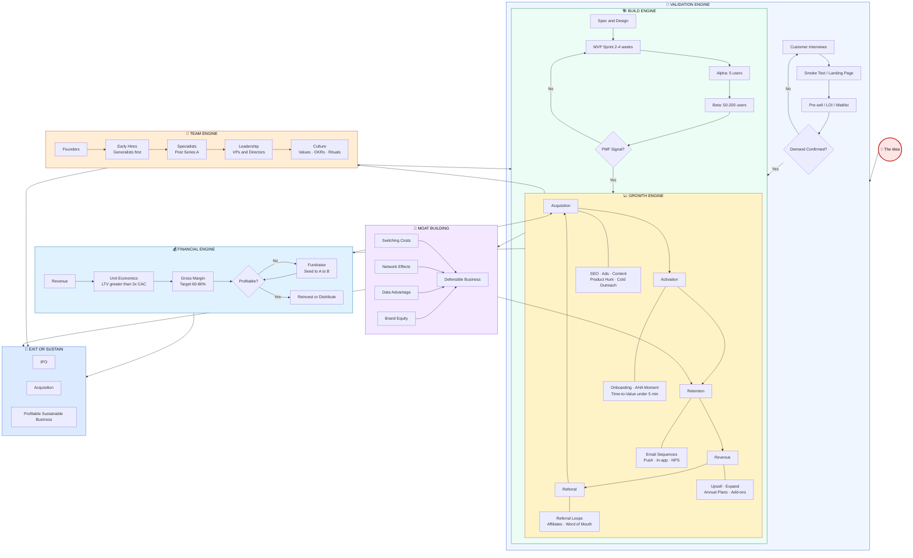

### 4. The Operational Mesh Network (Advanced)
How every department, signal, and tool connects in a self-sustaining operating system.

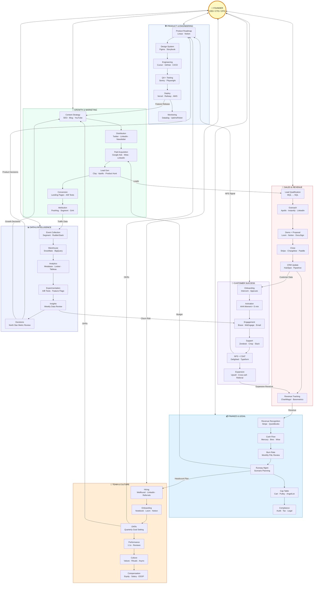

## 🔥 Startup Failure Autopsy

Why do most startups die? This decision tree maps the real reasons.

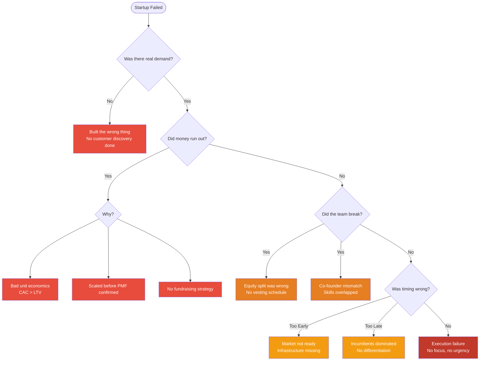

---

## 🗺️ Go-To-Market Strategy Selector

Pick the wrong GTM motion and you waste months. Use this to find yours.

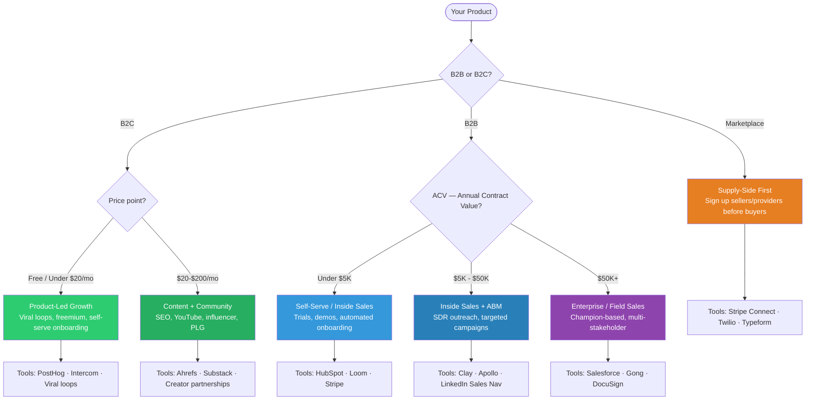

---

## 🏦 Fundraising Stage Gate

What investors actually look for at each funding stage.

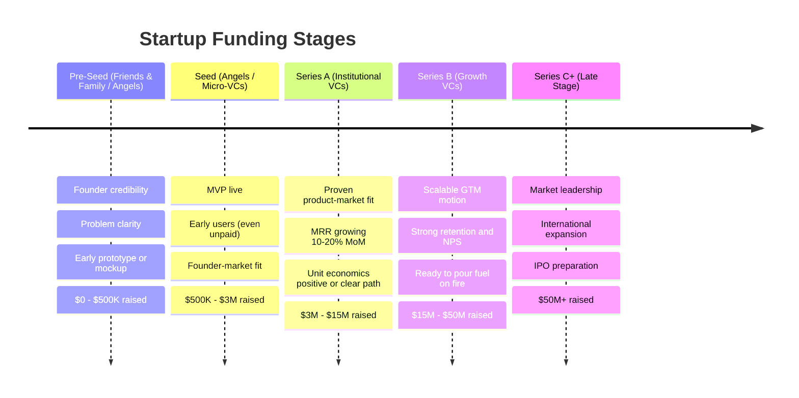

---

## 🕸️ The 5 Types of Network Effects

Not all moats are equal. Network effects are the strongest — but only if you pick the right type for your business.

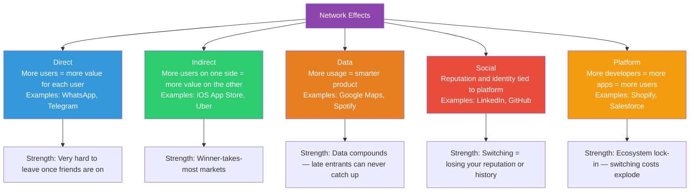

---

## 🚨 Burn Rate Danger Zone

Know exactly where you stand — and what to do at each stage.

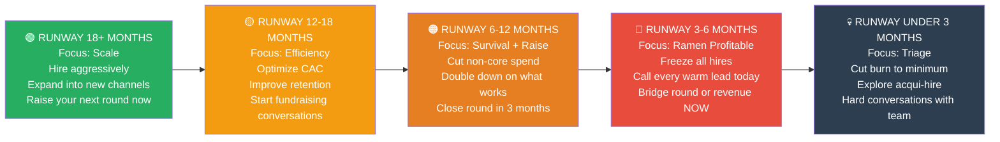

---

## ☠️ AARRR Pirate Metrics — Full Stack Map

Every stage of your funnel mapped to tools and KPIs.

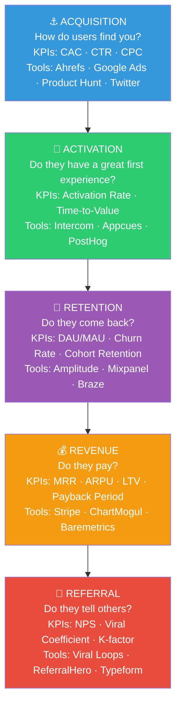

---

## 📉 Equity Dilution Reality Check

Most founders don't see this coming. Here's what happens to your ownership across rounds.

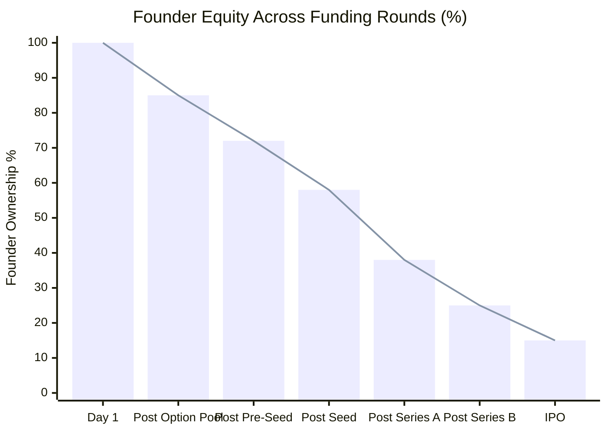

> Each round, new shares are issued. Your percentage shrinks even if your absolute value grows. A 15% stake in a $1B company ($150M) is worth far more than 100% of nothing — but you must understand this **before** you sign term sheets.

**Key dilution events:**
- Option pool shuffle (pre-money) — investors ask for 10-15% pool created before valuation
- Anti-dilution clauses — protect investors, not you
- Pay-to-play provisions — miss a round and lose preferred rights
- Liquidation preferences — investors get paid first on exit

---

## 📬 The Cold Outreach Formula

Works for client acquisition, investor outreach, and partnership pitches.

**Structure (5 sentences max):**

```
1. HOOK       — One specific thing about THEM (not generic flattery)
2. BRIDGE     — Why you're reaching out NOW (trigger event or relevance)
3. VALUE      — What you can do for them specifically (not what you do)
4. PROOF      — One line of credibility (result, company, or mutual connection)
5. SOFT CTA   — One easy yes/no question (not "let's hop on a call")
```

**Template — Client:**
> "Saw your post about [specific problem]. We built a tool that solved exactly this for [similar company] — cut their [metric] by 40% in 6 weeks. Would a quick breakdown be useful?"

**Template — Investor:**
> "You invested in [Company X] in [year]. We're solving a similar distribution problem in [market] — already at $8K MRR after 3 months. Would a 10-slide deck be worth your time?"

**Template — Partnership:**
> "Your users often ask for [gap]. We fill it exactly. [Company Y] ran a similar integration and added 15% to retention. Open to a 15-min call to see if it fits?"

**What kills cold outreach:**
- Opening with "I" instead of "You"
- Talking about your product before their problem
- Asking for 30-45 minutes on first contact
- No specificity — could have been sent to 1000 people

---

## 🔍 The "Is This a Real Business?" Filter

Answer these 5 questions brutally honestly before writing a single line of code:

| # | Question | Red Flag Answer |
|---|---|---|
| 1 | Who **exactly** is the customer? (Name a real person) | "Anyone who needs X" |
| 2 | What is their **exact** pain — in their own words? | You've never talked to one |
| 3 | Will they pay for it **today**, not "eventually"? | "Yes once it's better" |
| 4 | Can you reach **1,000 of them** without ads? | No clear channel exists |
| 5 | What stops a bigger player from **copying this in 6 months**? | Nothing |

If you can't answer all 5, you don't have a business yet — you have a hypothesis. That's fine. But validate first.

---

## 💲 Pricing Psychology Cheat Sheet

Most founders underprice by 3-5x. They price on cost, not value.

| Technique | How It Works | Example |
|---|---|---|
| **Anchoring** | Show a high price first so the real price feels cheap | $999/yr crossed out, $499/yr highlighted |
| **Decoy Pricing** | Add a middle tier that makes the top tier look like a deal | Basic $9 · Pro $19 · Business $18 → nobody picks Pro |
| **Charm Pricing** | End in 9 or 7 — perceived as significantly less | $97 feels much less than $100 |
| **Loss Aversion** | Frame as what they lose without it, not what they gain | "You're leaving $3,400/mo on the table" |
| **Value-Based** | Price on outcome delivered, not hours/features | Saves 10 hrs/wk × $50/hr = $2,000/mo → charge $400/mo |
| **Tier Anchoring** | Make the middle tier the obvious choice | Always 3 tiers; design the middle one first |
| **Annual Upfront** | Offer 2 months free for annual — improves cash flow and reduces churn | $99/mo or $990/yr (2 months free) |

> **Rule of thumb:** Whatever price you're thinking, double it. Then test. You can always go down; going up is painful.

---

## 🏰 The Moat Builder Matrix

| Moat Type | How to Build It | When to Start | Examples |
|---|---|---|---|
| **Switching Costs** | Deep integrations, data migration pain, workflow lock-in | From day 1 — design stickiness in | Salesforce, Slack |
| **Network Effects** | Make product better with each new user | As early as possible — hard to retrofit | WhatsApp, Airbnb |
| **Brand** | Consistent voice, community, strong POV | After PMF — can't fake it early | Apple, Notion |
| **Scale Economies** | Lower unit cost as volume grows | Series A+ — needs capital | Amazon, Stripe |
| **Data Advantage** | Proprietary data nobody else can get | From day 1 — collect everything | Google, Spotify |
| **IP / Patents** | Defensible technology or process | When you have something genuinely novel | Moderna, Qualcomm |
| **Regulatory** | Licenses, certifications, government relationships | When entering regulated markets | Banks, telcos |

> Most early startups can only build **switching costs** and **data advantage** from day 1. Network effects and brand come after PMF. Plan accordingly.

---

## 🧭 The Delegation Framework

Founders become the bottleneck when they can't let go. Use this 4-quadrant system:

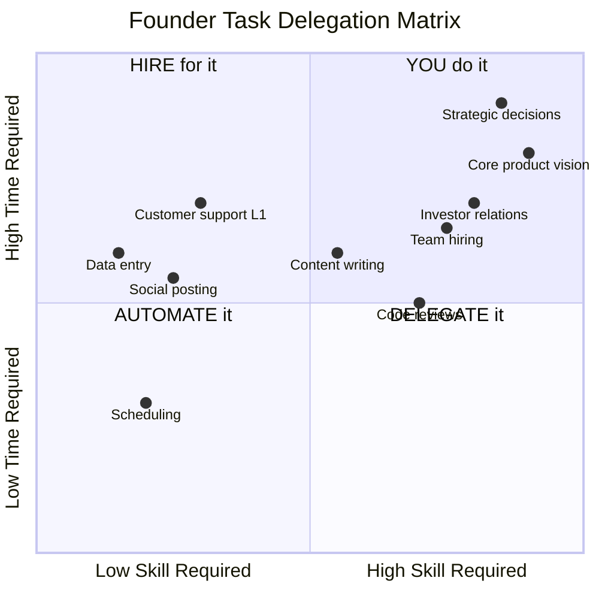

**Simple rule:**
- **High skill + Low time** → You do it (strategic, quick)
- **High skill + High time** → Hire someone
- **Low skill + Low time** → Automate with AI/tools
- **Low skill + High time** → Delegate to team or VA

---

## 📈 Micro-SaaS to Scale: The Progression Map

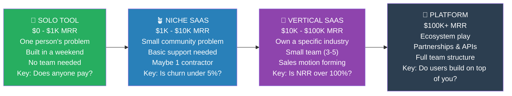

**What changes at each stage:**
| Stage | Biggest Challenge | What to Focus On |
|---|---|---|
| Solo Tool | Nobody knows it exists | Distribution > Product |
| Niche SaaS | Churn kills growth | Retention + onboarding |
| Vertical SaaS | Hiring wrong people | Process + team |
| Platform | Competitors copy you | Ecosystem + moat |

---

## 🚩 Investor Red Flag Checklist

VCs have pattern-matched thousands of pitches. These kill deals instantly:

| Red Flag | Why It's Fatal |
|---|---|
| "We have no competition" | Either no market exists, or you haven't researched |
| Market sizing is top-down only | "1% of a $10B market" = not credible |
| No evidence of customer conversations | You're building on assumption |
| Asking for NDA before pitch | Signals inexperience; VCs see 1000s of ideas |
| No understanding of unit economics | Can't run the business if you can't model it |
| Founders can't explain why **now** | Timing is everything — why is this the moment? |
| Product demo doesn't work in the pitch | Preparation problem signals execution problem |
| Equity split is 50/50 with no vesting | Conflict magnet; no vesting = co-founder risk |
| "We just need to go viral" | Not a distribution strategy |
| Projecting $100M revenue in year 3 with no basis | Destroys credibility on all other numbers |

---

## 📢 The "Build in Public" Content Engine

Build your audience while you build your product. Compounding attention is an asset.

**The Weekly Loop:**

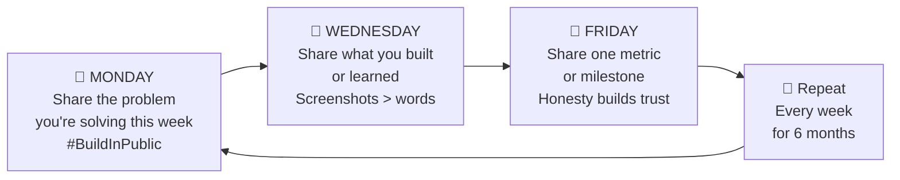

**Content formats that work:**
- "We went from X to Y in Z days — here's how"
- "I was wrong about [assumption]. Here's what we learned"
- "Shipped: [feature]. The problem it solves:"
- "Week 12 metrics: [honest numbers]"
- "We almost quit. Here's why we didn't"

**Platforms by audience:**
| Platform | Best For |
|---|---|
| Twitter/X | Tech founders, developers, investors |
| LinkedIn | B2B buyers, enterprise, recruiters |
| YouTube | Long-form, tutorials, product demos |
| Reddit | Niche communities, early adopters |
| Newsletter | Direct line to your most engaged readers |

---

## ⚖️ Legal Entity Decision Tree

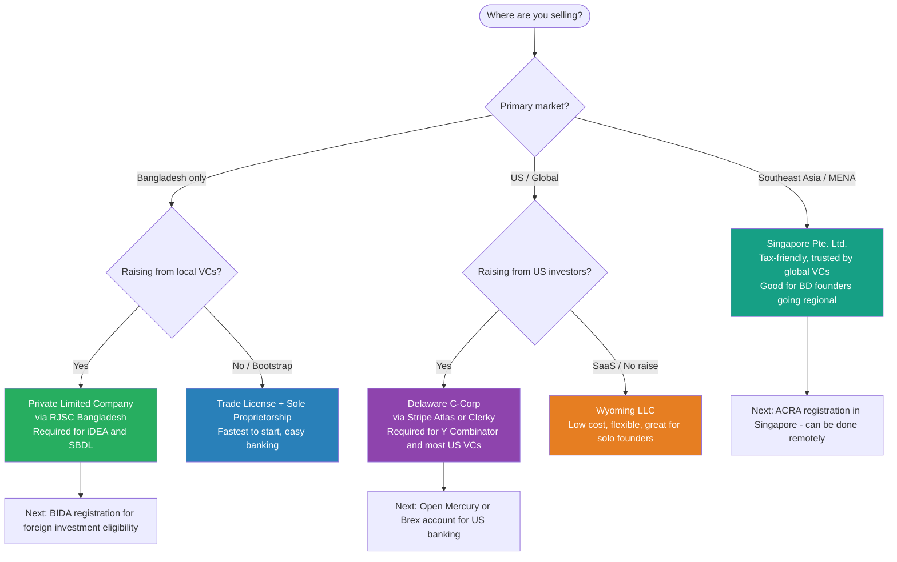

---

## 🤖 AI Agent Architecture for Founders

How to wire your own AI employee for any repetitive business task.

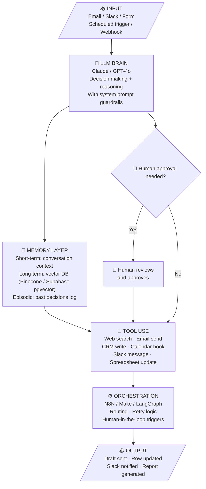

**Real examples you can build today:**
| Agent | What It Does | Stack |
|---|---|---|
| Lead Qualifier | Scores inbound leads, sends personalized reply | Claude + Make + HubSpot |
| Support Triage | Classifies tickets, answers L1, escalates L2 | GPT-4o + Intercom + Notion |
| Competitor Monitor | Weekly digest of competitor moves | Perplexity + N8N + Slack |
| Invoice Chaser | Sends polite payment reminders on schedule | Claude + Make + Gmail |
| Content Repurposer | Turns blog post into 5 tweets + LinkedIn post | Claude + Buffer API |

---

## 🕵️ The "Steal Like a Founder" Competitive Analysis Template

For any competitor, answer these 7 questions. The gaps are your entry points.

| Question | Where to Find It | What to Do With It |
|---|---|---|
| Who is their exact ICP? | Their homepage, case studies, LinkedIn ads | Find the customer segment they ignore |
| What's their pricing? | Pricing page or G2/Capterra | Find the tier they don't serve (too cheap or too expensive) |
| What do 1-star reviews say? | G2, Trustpilot, App Store, Reddit | That's your feature list |
| What SEO keywords do they rank for? | Ahrefs or Semrush | Find high-volume gaps they miss |
| What do their job postings reveal? | LinkedIn, their careers page | Shows where they're investing next |
| Who just left their company? | LinkedIn — filter ex-employees | Potential hires who know the product deeply |
| What's their NPS? | Reviews + Twitter complaints | Low NPS = high churn = opportunity |

---

## 📋 One-Page Business Model Canvas

Fill this out in 30 minutes before building anything:

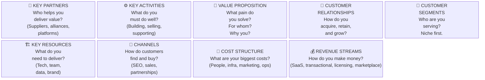

---

## 📊 The Weekly Founder Metrics Dashboard

Review these 7 numbers every Monday morning. Nothing else matters until these are healthy.

| Metric | What It Tells You | Healthy Range | Red Flag |
|---|---|---|---|
| **MRR** (Monthly Recurring Revenue) | Is the business growing? | 10-20% MoM growth | Flat or declining |
| **Net Churn** | Are you losing more than you gain? | Under 2% monthly | Over 5% monthly |
| **CAC** (Customer Acquisition Cost) | How expensive is growth? | Under 1/3 of LTV | CAC > LTV |
| **Activation Rate** | Do new users get value? | Over 40% | Under 20% |
| **DAU/MAU Ratio** | Is your product sticky? | Over 20% | Under 10% |
| **Runway** | How long can you survive? | Over 12 months | Under 6 months |
| **NPS** (Net Promoter Score) | Do users love you enough to refer? | Over 40 | Under 20 |

> Track these in a simple Notion table or Airtable. Review every Monday at 9am. Make it a ritual.

---

## 📈 Pitch Deck Mastery (2025 Edition)

Building a deck is about telling a story backed by undeniable data. VCs in 2025 are looking for **path-to-profitability** and **sustainable growth**.

### Key Benchmark Slides
1.  **TAM / SAM / SOM**: Market sizing must be bottom-up, not just top-down.
2.  **Unit Economics**: Focus on LTV:CAC ratios (aim for >3:1).
3.  **Traction**: Cohort analysis and retention trends are non-negotiable.
4.  **AI Integration**: How is AI driving efficiency or creating a moat?

### Best-in-Class Templates
- [Airbnb's Original Deck](https://www.alexanderjarvis.com/airbnb-pitch-deck-original-pitch/) - The gold standard for simplicity.
- [Sequoia Capital Template](https://www.sequoiacap.com/build/pitch-deck-template/) - The industry benchmark.
- [Front Series C Deck](https://front.com/blog/fronts-series-c-pitch-deck) - Masterclass in transparency and data.
- [DocSend Fundraising Research](https://www.docsend.com/fundraising-research/) - Real-time statistics on what VCs are opening.

---

## 🇧🇩 Bangladesh Startup Ecosystem

The ecosystem in Bangladesh is thriving. Here are the essential hubs for local founders.

### 🚀 Accelerators & Incubators
- [iDEA Project](https://idea.gov.bd/) - Government grant (BDT 10L) and mentoring. **(Highly Recommended First Step)**
- [GP Accelerator](https://www.grameenphone.com/about/gp-accelerator) - Leading tech accelerator by Grameenphone.
- [Smart Bangladesh Accelerator](https://acceleratingbangladesh.com/) - Collaborative hub for startup leaders.
- [BYLC Ventures](https://bylc.org/bylcventures) - Funding and incubation for ethical leaders.
- [BIDA (Entrepreneurship & Skill Development)](https://bida.gov.bd/) - Critical for regulatory and investment support.

### 💰 Venture Capital & Angels (Genuine)
- [Startup Bangladesh Limited](https://startupbangladesh.vc/) - Flagship VC (ICT Ministry). Focus: Equity/Seed/Growth.
- [Bangladesh Angels Network](https://bdangels.co/) - Best for early angel rounds and networking.
- [Anchorless Bangladesh](https://anchorless.vc/) - Deep-market VC for high-scale ventures.
- [SBK Tech Ventures](https://sbktechventures.com/) - Focus on impact and female-led tech.

### 📰 News, Portals & Communities
- [Future Startup](https://futurestartup.com/) - Deep-dive interviews and ecosystem analysis.
- [TechNext](https://technext.it/blog/) - Comprehensive news on the tech ecosystem.
- [LightCastle Partners](https://www.lightcastlepartners.com/) - Essential market research and ecosystem reports.
- [Startup Bangladesh Discord](https://discord.gg/startupbangladesh) - Community chatter and networking.

### 🤝 📜 Regulatory & Financials (Bangladesh Specific)
- **Incorporation**: [RJSC (Registrar of Joint Stock Companies)](https://roc.gov.bd/) - Required for equity investment.
- **Trade License**: Essential for B2B contracts and bank accounts.
- **Inward Remittance**: Understanding [Form C](https://www.bb.org.bd/) and local banking regulations for foreign investment.
- **BIDA Support**: For industrial plot allocation and foreign loan approvals.

---

## 💳 The bKash Effect — How BD's #1 Startup Built an Unbreakable Monopoly

bKash is the most important case study for every Bangladeshi founder. It was not a tech company — it was a **distribution company** that used tech. Founded in 2011 as a BRAC Bank subsidiary, backed by the Gates Foundation and Alipay, it solved one problem: 170M people, mostly unbanked, but 80%+ had a mobile phone.

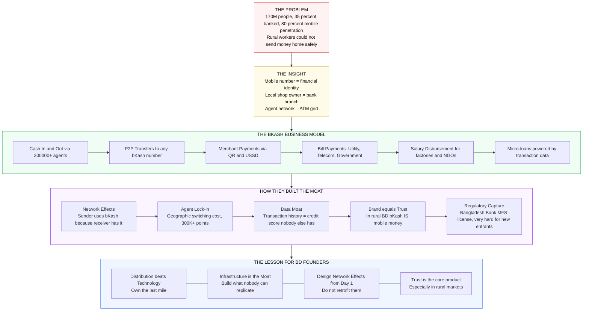

> **The bKash lesson**: Don't ask "what app can I build?" Ask "what distribution problem can I own?" In Bangladesh, whoever owns the last-mile relationship wins.

---

## 🗺️ BD Startup Success Pattern Map

The top BD startups all followed a recognizable playbook. Most founders don't see the pattern until it's too late to copy it.

```mermaid
flowchart TD
    subgraph PATTERN["THE WINNING PATTERN"]
        S1["1. Find a hyper-local friction\nthat global companies ignore"] -->
        S2["2. Integrate bKash and Nagad on day 1\nthey have different user bases, need both"] -->
        S3["3. Own distribution before technology"] -->
        S4["4. Defend with data and local relationships"] -->
        S5["5. Raise locally: iDEA, Angels, SBDL"] -->
        S6["6. Raise regionally: Singapore, India VCs"] -->
        S7["7. Go global: YC, Delaware, US VCs"]
    end

    subgraph EXAMPLES["WHO DID IT AND HOW"]
        direction LR
        C1["Chaldal\nFriction: Grocery delivery in Dhaka\nModel: Dark store quick commerce\nMoat: Route data and dark store network\nOutcome: YC W15 backed"] ---
        C2["Shikho\nFriction: SSC and HSC exam prep\nModel: Subscription video content\nMoat: Fully localized BD curriculum\nInspired by: Byju's India"] ---
        C3["ShajGoj\nFriction: Women's beauty in offline BD\nModel: Marketplace plus community\nMoat: User trust and beauty data\nInspired by: Nykaa India"]
    end

    subgraph MORE["MORE EXAMPLES"]
        direction LR
        C4["Truck Lagbe\nFriction: Unorganized freight\nModel: Two-sided marketplace\nMoat: Network effects\nInspired by: BlackBuck India"] ---
        C5["Pathao\nFriction: Dhaka traffic\nModel: Moto ride-hailing to super app\nMoat: First mover and brand\nInspired by: Gojek and Rapido"] ---
        C6["10 Minute School\nFriction: Quality education access\nModel: Free YouTube then paid courses\nMoat: Ayman Sadiq personal brand\nDistribution: Facebook and YouTube organic"]
    end

    subgraph FAILS["WHAT DOES NOT WORK IN BD"]
        direction LR
        F1["Pure SaaS at global pricing\nBD SME WTP is 5 to 10x lower"] ---
        F2["Copy-paste Western B2C\nPayment infrastructure is different"] ---
        F3["B2B without a relationship champion\nRelationships beat products here"] ---
        F4["Ignoring bKash and Nagad\nMost users do not use credit cards"]
    end

    style PATTERN fill:#eff6ff,stroke:#2563eb,color:#111
    style EXAMPLES fill:#f0fdf4,stroke:#16a34a,color:#111
    style MORE fill:#fefce8,stroke:#ca8a04,color:#111
    style FAILS fill:#fef2f2,stroke:#dc2626,color:#111
```

---

## 🌀 The "Local Before Global" Flywheel

This is the exact path every successful BD startup that went global followed.

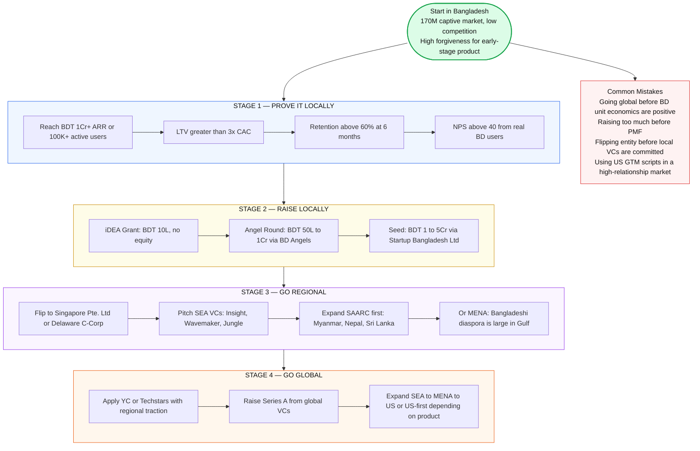

---

## ⚖️ Bangladesh Regulatory Cheat Sheet

Know who controls what before you hit a wall at Series A.

```mermaid
flowchart TD
    REG["BANGLADESH REGULATORY LANDSCAPE"] --> BB & BTRC & NBR & BIDA & RJSC & DGDA

    BB["Bangladesh Bank\nMFS licenses, Payment systems\nForex, Foreign investment repatriation\nWALL: MFS license nearly impossible\nfor new entrants to obtain"]

    BTRC["BTRC\nTelecom, Internet, OTT services\nVoIP, ISPs\nWALL: VoIP without license is illegal\nOTT regulations incoming in 2025"]

    NBR["National Board of Revenue\nAll taxes: VAT, Income Tax, Customs\nWALL: 15% VAT on digital ads\nhits your CAC significantly"]

    BIDA["BIDA\nForeign investment approval\nIndustrial allocation, One Stop Service\nFRIEND: Fast-track approvals\nfor priority tech sectors"]

    RJSC["RJSC\nCompany registration\nRequired for equity, trade license\nSIMPLE: Online in 2 to 4 weeks"]

    DGDA["DGDA\nHealth products, Medical devices\nPharmaceuticals\nWALL: Healthtech with diagnostics\nrequires DGDA approval first"]

    style REG fill:#fefce8,stroke:#ca8a04,color:#111,stroke-width:2px
    style BB fill:#fef2f2,stroke:#dc2626,color:#111
    style BTRC fill:#fff7ed,stroke:#ea580c,color:#111
    style NBR fill:#fefce8,stroke:#ca8a04,color:#111
    style BIDA fill:#f0fdf4,stroke:#16a34a,color:#111
    style RJSC fill:#eff6ff,stroke:#2563eb,color:#111
    style DGDA fill:#faf5ff,stroke:#9333ea,color:#111
```

### 🚦 Regulatory Risk by Sector

| Sector | Regulator | Key Risk | Time to Clear |
|---|---|---|---|
| **Fintech / MFS** | Bangladesh Bank | License required — very hard | 12-24 months |
| **Edtech (content)** | None | No license for content | Days |
| **Healthtech** | DGDA | Device/diagnostic approval | 6-18 months |
| **Logistics** | BRTA | Vehicle and freight licensing | 1-3 months |
| **SaaS / Software** | None | Lowest risk — best sector to start | Days |
| **Digital Media / OTT** | BTRC | Policy uncertain — watch carefully | Unknown |
| **Insurance** | IDRA | Full license required | 18-36 months |

> **Tactical advice**: If you're in a regulated sector, hire a regulatory consultant on day 1. It's BDT 50K/month that can save the entire company.

---

## 🎯 How to Win in Bangladesh — The GTM Playbook

Standard playbooks from the US or India break without these BD-specific adaptations.

```mermaid
flowchart TD
    START{Primary\ncustomer type?} --> B2C & B2B & GOV

    subgraph B2C["B2C PLAYBOOK"]
        BC1["Step 1: bKash AND Nagad on day 1\nDifferent user bases, need both"] -->
        BC2["Step 2: SMS and Facebook first\nBD users rarely open email\nFacebook is the #1 acquisition channel"] -->
        BC3["Step 3: Build referral mechanics\nBD is highly social, word of mouth\nconsistently beats paid ads"] -->
        BC4["Step 4: Design for low-end devices\nFeature phones matter in rural BD\nMobile data is expensive outside Dhaka"] -->
        BC5["Step 5: Trust signals\nLocal celebrity or brand partnership\ncloses the trust gap fast"]
    end

    subgraph B2B["B2B PLAYBOOK"]
        BB1["Step 1: Find the internal champion\nUsually IT head or CEO\nRelationship beats product demo every time"] -->
        BB2["Step 2: Free 3-month pilot is expected\nDo not fight it, use it to lock in retention"] -->
        BB3["Step 3: Invoice in BDT always\nEven if priced in USD internally"] -->
        BB4["Step 4: Reference sell aggressively\nOne logo unlocks 10 more\nBD B2B is extremely reference-driven"] -->
        BB5["Step 5: Invest in account management\nBD B2B churns when the relationship churns\nnot when the product fails"]
    end

    subgraph GOV["GOVERNMENT PLAYBOOK"]
        GV1["Step 1: Register as approved vendor\nwith the relevant ministry"] -->
        GV2["Step 2: Find a relationship connector\nBudget 5 to 10 percent of deal value"] -->
        GV3["Step 3: Survive the payment cycle\nGovernment pays 90 to 180 days late\nMaintain working capital buffer"] -->
        GV4["Step 4: Use the logo aggressively\nGovernment client = strongest BD B2B trust signal"]
    end

    B2C --> UNI
    B2B --> UNI
    GOV --> UNI

    subgraph UNI["UNIVERSAL BD RULES"]
        U1["Founder personal brand beats company brand\nPublic founders close deals faster"] ---
        U2["Facebook dominates everything\n45M+ users, groups are BD's Reddit"] ---
        U3["Offline plus Online hybrid required\nPure digital only works in Dhaka"] ---
        U4["Ramadan is peak B2C season\nPlan biggest launches around it"]
    end

    style B2C fill:#f0fdf4,stroke:#16a34a,color:#111
    style B2B fill:#eff6ff,stroke:#2563eb,color:#111
    style GOV fill:#fefce8,stroke:#ca8a04,color:#111
    style UNI fill:#fff7ed,stroke:#ea580c,color:#111
```

---

## 👨‍💻 Bangladesh Talent Arbitrage Map

BD developers are among the most underpriced globally. This is the arbitrage smart global companies exploit — local founders must defend it.

### Salary Benchmarks (Dhaka, 2025)

| Role | BD BDT/mo | BD USD/mo | Singapore USD/mo | Advantage |
|---|---|---|---|---|
| Junior Dev (0-2yr) | 25K - 50K | $230 - $460 | $4,000 - $6,000 | **13x cheaper** |
| Mid Dev (2-5yr) | 60K - 120K | $550 - $1,100 | $6,000 - $9,000 | **8x cheaper** |
| Senior Dev (5+yr) | 120K - 250K | $1,100 - $2,300 | $9,000 - $14,000 | **7x cheaper** |
| Tech Lead | 200K - 400K | $1,800 - $3,700 | $12,000 - $18,000 | **6x cheaper** |
| Product Manager | 80K - 200K | $730 - $1,800 | $7,000 - $12,000 | **7x cheaper** |
| Data Scientist | 100K - 250K | $920 - $2,300 | $8,000 - $13,000 | **6x cheaper** |

### Top Talent Pipeline

```mermaid
graph TD
    TALENT["BD TECH TALENT PIPELINE"] --> T1 & T2 & T3 & ONLINE

    subgraph T1["TIER 1 — Elite Engineering"]
        BUET["BUET\nTop 1% talent in BD\nCS, EE, ME graduates\nLeave fast — offer equity early"] ---
        MIST["MIST\nStrong embedded systems\nand hardware graduates"] ---
        IUT["IUT\nStrong CS and Engineering\nLess known but high quality"]
    end

    subgraph T2["TIER 2 — Volume + Quality"]
        NSU["NSU\nLargest private CS pool\nStrong English and product mindset\nBest for client-facing roles"] ---
        SUST["SUST\nStrong CS in Sylhet\nGood for backend roles"] ---
        BRACU["BRAC University\nStrong design and CS\nEntrepreneurial culture"] ---
        DU["Dhaka University CSE\nStrong theory and competitive programming"]
    end

    subgraph T3["TIER 3 — High Volume"]
        DIU["DIU\nLargest enrollment in BD\nHigh volume for junior roles"] ---
        OTHERS["UIU, EWU, AIUB\nGrowing programs\nGood junior talent pools"]
    end

    subgraph ONLINE["Online and Freelance"]
        FREE["BD is globally top-5 in freelancing\nUpwork, Toptal, Fiverr\nHireable full-time at 2-3x freelance rate"] ---
        COMM["Developer Communities\nBD Dev Community, React BD\nPython BD, Dhaka.ai"]
    end

    style TALENT fill:#fefce8,stroke:#ca8a04,color:#111
    style T1 fill:#fef2f2,stroke:#dc2626,color:#111
    style T2 fill:#eff6ff,stroke:#2563eb,color:#111
    style T3 fill:#f0fdf4,stroke:#16a34a,color:#111
    style ONLINE fill:#faf5ff,stroke:#9333ea,color:#111
```

**Hiring tips:**
- BUET grads leave for FAANG remote in 18 months — offer equity on day 1
- NSU grads have strong English — excellent for product and client-facing roles
- Upwork/Fiverr freelancers can be hired full-time at 2-3x their freelance rate, battle-tested
- Facebook groups reach far more junior talent than LinkedIn in BD
- In-person interviews are still expected — remote-first culture is less mature than India

---

## 🇮🇳 India Playbook — What Bangladesh Should Copy Right Now

India is 5-7 years ahead of BD in ecosystem maturity. Run the BD version of what's working there before someone else does.

### Indian Models That Translated to BD

| Indian Company | Category | BD Version | What Worked | What Needed Adapting |
|---|---|---|---|---|
| **Byju's** | Edtech | **Shikho** | Subscription video, mobile-first | BD SSC/HSC curriculum, full Bangla UI |
| **BigBasket / Zepto** | Quick Commerce | **Chaldal** | Dark store, fast delivery SLA | Smaller SKU count, bKash/Nagad payments |
| **BlackBuck / Porter** | Freight | **Truck Lagbe** | Supply-demand matching | BD truck owner dynamics |
| **Rapido / Ola Bike** | Moto Ride-hailing | **Pathao** | Motorbike solves congestion | BD licensing, fuel price sensitivity |
| **Nykaa** | Beauty Marketplace | **ShajGoj** | Content plus commerce flywheel | Bangladeshi brands, rural SKUs |
| **Razorpay** | Payment Gateway | **SSLCommerz / ShurjoPay** | Developer-friendly API | bKash/Nagad, BDT settlement |
| **Urban Company** | Home Services | **Sheba.xyz** | Gig economy for skilled labor | Dhaka-specific service categories |

### What India Is Building Now — BD Should Watch

```mermaid
flowchart LR
    subgraph IND["INDIA RIGHT NOW 2025"]
        I1["ONDC\nOpen Network for Digital Commerce\nIndia's answer to Amazon monopoly\nAny seller, any buyer, any app"] ---
        I2["Account Aggregator\nFinancial data sharing with consent\nPowers next-gen credit and lending"] ---
        I3["UPI Credit Line\nBNPL built on UPI rails\nCredit at merchant checkout"] ---
        I4["DPDP Act\nIndia's GDPR equivalent\nData localization and user rights"] ---
        I5["Bharat Stack\nAadhaar + UPI + DigiLocker\nGovernment infra as startup platform"]
    end

    subgraph BDO["BD EQUIVALENT AND OPPORTUNITY"]
        B1["No ONDC equivalent yet\nOpportunity: build BD open\ncommerce network with Commerce Ministry"] ---
        B2["BB exploring Account Aggregator\nOpportunity: build the\nconsent data layer now"] ---
        B3["bKash credit exists but underdeveloped\nOpportunity: embedded credit\nat merchant checkout for SMEs"] ---
        B4["No DPDP equivalent yet\nRisk: it will come\nBuild good data practices now"] ---
        B5["NID + Mobile = BD Stack\nbKash + Nagad + BRTA database\nBuild products on these existing rails"]
    end

    I1 --> B1
    I2 --> B2
    I3 --> B3
    I4 --> B4
    I5 --> B5

    style IND fill:#fff7ed,stroke:#ea580c,color:#111
    style BDO fill:#f0fdf4,stroke:#16a34a,color:#111
```

### Why India's B2B SaaS Pricing Fails in BD

| Factor | India | Bangladesh | Fix |
|---|---|---|---|
| **SME tech budget** | $200-2,000/yr | $20-200/yr | Price 10x lower or find a different segment |
| **Decision maker** | CEO or Finance Head | Owner-operator (same person) | Shorter cycle but more emotional |
| **Payment method** | Credit card / NEFT | bKash / bank transfer | Accept bKash invoice or you won't get paid |
| **Contract norms** | Annual contracts | Monthly preferred, no lock-ins | Monthly billing, low friction to cancel |
| **Reference culture** | Moderate | Absolutely critical | First logo unlocks the next 10 |
| **English fluency** | High in B2B | Medium — Bangla UI preferred | Localize or lose the SME market entirely |

---

## 🏛️ The "Holy Grail" Bridge: Dhaka to Global

For a Bangladeshi founder, the goal is often a local launch with a global scale. This diagram maps the connection between national support and international capital.

```mermaid
graph TD
    subgraph "National Foundation (Dhaka Focused)"
        Idea[Idea & Local Validation]
        iDEA{iDEA Grant<br/>BDT 10L}
        Trade[RJSC & Trade License]
        SBDL[Startup Bangladesh Ltd<br/>Seed Equity]
        BAngels[Bangladesh Angels]
    end

    subgraph "International Leap (Scale Focused)"
        YC[Y Combinator / Techstars]
        SG_Hub[Singapore / Dubai Hub]
        GlobalVC[Global VC<br/>Sequoia/Lightspeed]
        Stripe_Atlas[Stripe Atlas / US Delaware Corp]
    end

    %% Connections (The Bridge)
    Idea --> Trade
    Trade --> iDEA
    iDEA --> BAngels
    BAngels --> SBDL
    
    %% The Transition
    SBDL -- "Series A / Global Traction" --> SG_Hub
    SBDL -- "US Entity Setup" --> Stripe_Atlas
    Stripe_Atlas --> YC
    SG_Hub --> GlobalVC
    YC --> GlobalVC

    %% Styling
    style iDEA fill:#27ae60,stroke:#fff,color:#fff
    style SBDL fill:#2980b9,stroke:#fff,color:#fff
    style YC fill:#e67e22,stroke:#fff,color:#fff
    style GlobalVC fill:#8e44ad,stroke:#fff,color:#fff
```

## 🗺️ The Bangladesh Investment Roadmap

How the system works for a Bangladeshi founder.

### 1. The Funding Journey
1.  **Stage 0: Ideation (iDEA Grant)**: Apply to [iDEA Project](https://idea.gov.bd/) for a **BDT 10 Lakh** non-equity grant. Perfect for prototype building.
2.  **Stage 1: Validation (Seed Equity)**: Pitch to [Startup Bangladesh Limited](https://startupbangladesh.vc/) for seed equity (typically BDT 25L to 5Cr).
3.  **Stage 2: Angel Round**: Leverage your traction to pitch to [Bangladesh Angels](https://bdangels.co/).
4.  **Stage 3: Growth Round**: Seek foreign VC (e.g., Anchorless, Pegasus) or follow-on from Startup Bangladesh Ltd.

### 2. How to Prepare (The "Bangladeshi Checklist")
- **Trade License & Incorporation**: Must be locally registered to qualify for iDEA or Startup Bangladesh funds.
- **Pitch Deck (12-14 Slides)**: Focus on local market size (TAM/SAM/SOM) and why Bangladesh is ready for your solution *now*.
- **5-Min Video Pitch**: Often required for government grants. Keep it 3 mins on the problem/solution and 2 mins on the founders.
- **Financial Projections**: For Startup Bangladesh Ltd, they expect a 3-5 year clear P&L projection with a path to profitability.

### 🌐 Strategy for Going Global from Bangladesh
1.  **Registry Choice**: Start local for iDEA/SBDL. If raising from the US/Global, consider a "flip" (setting up a Delaware C-Corp) using [Stripe Atlas](https://dashboard.stripe.com/atlas).
2.  **Market Staging**: Use the 170M+ market in Bangladesh to prove your unit economics. Once profitable/validated, expand to Southeast Asia or MENA.
3.  **Cross-Border Banking**: Use [Airwallex](https://www.airwallex.com/) or [Mercury](https://mercury.com/) for international transactions once you have a US entity.

---

## Quick Start

1. **Browse by Category** - Use the table of contents below to jump to specific sections
2. **Search** - Press `Ctrl+F` (or `Cmd+F` on Mac) to find specific tools
3. **Bookmark** - Star this repo to keep it handy
4. **Contribute** - Found something useful? Add it via pull request!

## 📋 Table of Contents

- [Bangladesh: bKash Effect](#-the-bkash-effect--how-bds-1-startup-built-an-unbreakable-monopoly)
- [Bangladesh: Startup Success Patterns](#️-bd-startup-success-pattern-map)
- [Bangladesh: Local Before Global Flywheel](#-the-local-before-global-flywheel)
- [Bangladesh: Regulatory Cheat Sheet](#️-bangladesh-regulatory-cheat-sheet)
- [Bangladesh: GTM Playbook](#️-how-to-win-in-bangladesh--the-gtm-playbook)
- [Bangladesh: Talent Arbitrage Map](#-bangladesh-talent-arbitrage-map)
- [India Playbook for BD Founders](#️-india-playbook--what-bangladesh-should-copy-right-now)
- [Startup Failure Autopsy](#-startup-failure-autopsy)
- [Go-To-Market Strategy Selector](#️-go-to-market-strategy-selector)
- [Fundraising Stage Gate](#-fundraising-stage-gate)
- [Network Effects Map](#️-the-5-types-of-network-effects)
- [Burn Rate Danger Zone](#-burn-rate-danger-zone)
- [AARRR Pirate Metrics](#️-aarrr-pirate-metrics--full-stack-map)
- [Equity Dilution Reality Check](#-equity-dilution-reality-check)
- [Cold Outreach Formula](#-the-cold-outreach-formula)
- [Is This a Real Business? Filter](#-the-is-this-a-real-business-filter)
- [Pricing Psychology Cheat Sheet](#-pricing-psychology-cheat-sheet)
- [Moat Builder Matrix](#️-the-moat-builder-matrix)
- [Delegation Framework](#-the-delegation-framework)
- [Micro-SaaS Progression](#-micro-saas-to-scale-the-progression-map)
- [Investor Red Flag Checklist](#-investor-red-flag-checklist)
- [Build in Public Engine](#-the-build-in-public-content-engine)
- [Legal Entity Decision Tree](#️-legal-entity-decision-tree)
- [AI Agent Architecture](#-ai-agent-architecture-for-founders)
- [Competitive Analysis Template](#️-the-steal-like-a-founder-competitive-analysis-template)
- [Business Model Canvas](#-one-page-business-model-canvas)
- [Weekly Metrics Dashboard](#-the-weekly-founder-metrics-dashboard)
- [Learning & Knowledge](#learning--knowledge)
- [Courses & Videos](#courses--videos)
- [Podcasts](#podcasts)
- [Inspiration & Discovery](#inspiration--discovery)
- [Company Building](#company-building)
- [Customer Development](#customer-development)
- [Incubators & Accelerators](#incubators--accelerators)
- [Communities](#communities)
- [Fundraising](#fundraising)
- [Website & Hosting](#website--hosting)
- [Design Tools](#design-tools)
- [Stock Resources](#stock-resources)
- [AI Startup Stack (2025)](#essential-ai-startup-stack-2025-build)
- [AI Tools](#ai-tools)
- [Content & SEO](#content--seo)
- [Automation & Backend](#automation--backend)
- [Payments](#payments)
- [Documentation](#documentation)
- [Email & Newsletters](#email--newsletters)
- [CRM & Support](#crm--support)
- [Analytics & Data](#analytics--data)
- [Marketing Tools](#marketing-tools)
- [User Feedback](#user-feedback)
- [User Engagement](#user-engagement)
- [Media & Video](#media--video)
- [Team Management](#team-management)
- [No-Code Tools](#no-code-tools)
- [Affiliates & Referrals](#affiliates--referrals)
- [Monitoring & Logging](#monitoring--logging)
- [Miscellaneous Tools](#miscellaneous-tools)
- [Startup Programs & Credits](#startup-programs--credits)
- [Places to Share & Promote](#places-to-share--promote)
- [Key Articles & Essays](#key-articles--essays)
- [Additional Learning Resources](#additional-learning-resources)
- [Founder's Operating System](#-founders-operating-system-beyond-the-single-skill)

---

## Learning & Knowledge

### Essential Reading

- [Paul Graham's Essays](https://paulgraham.com/)
- [Sam Altman's Blog](https://blog.samaltman.com/)
- [Startup Library](https://www.startuplibrary.io/)
- [Founder Resources](https://www.founderresources.com/)
- [Startup Handbook](https://www.startuphandbook.co/)
- [The Founder Library - NFX](https://www.nfx.com/founder-library)
- [Startup Notes](http://startupnotes.org/#page/1)

### Books

#### Foundational Startup Books
- [The Four Steps to the Epiphany - Steve Blank](https://amzn.to/46n8bP3))
- [The Startup Owner's Manual - Steve Blank](https://amzn.to/4rzkEaX))
- [Running Lean - Ash Maurya](https://amzn.to/4kPgZTB)
- [The Lean Startup - Eric Ries](https://amzn.to/4rwpzcI)
- [Zero to One - Peter Thiel](https://amzn.to/3ZMyWc3)
- [The Hard Thing About Hard Things - Ben Horowitz](https://amzn.to/4tFyBFA)
- [Founders At Work - Jessica Livingston](https://amzn.to/3OqEfvi)

#### Product & Growth
- [Hooked: How to Build Habit-Forming Products](https://www.hookedbook.com/)
- [Inspired: How to Create Tech Products Customers Love - Marty Cagan](https://www.inspiredbook.com/)
- [Empowered: Ordinary People, Extraordinary Products - Marty Cagan](https://www.empoweredbook.com/)
- [Traction: A Startup Guide to Getting Customers](https://www.tractionbook.com/)
- [The Cold Start Problem](https://www.coldstartproblem.com/)

#### Business & Strategy
- [Make - Bootstrapper's Handbook](https://www.makebootstrapper.com/)
- [The Founder's Dilemmas - Noam Wasserman](https://www.foundersdilemmas.com/)
- [Business Model Generation - Alexander Osterwalder](https://www.strategyzer.com/)
- [Hello, Startup](https://www.hello-startup.net/)

#### Fundraising & Investment
- [Venture Deals - Brad Feld and Jason Mendelson](https://venturedeals.com/)
- [Venture Capitalists at Work - Tarang Shah and Sheetal Shah](https://www.venturecapitalistsatwork.com/)

#### Personal Development
- [Atomic Habits - James Clear](https://www.amazon.com/Atomic-Habits-Proven-Build-Break/dp/0735211299)
- [Thinking, Fast and Slow - Daniel Kahneman](https://www.amazon.com/Thinking-Fast-Slow-Daniel-Kahneman/dp/0374533555)
- [The 7 Habits of Highly Effective People - Stephen Covey](https://www.amazon.com/Habits-Highly-Effective-People-Powerful/dp/0743269519)
- [First Things First - Stephen Covey](https://www.amazon.com/First-Things-Stephen-R-Covey/dp/0684802031)

#### Specialized Topics
- [The Mom Test - Rob Fitzpatrick](https://www.momtestbook.com/)
- [Disciplined Entrepreneurship: 24 Steps to a Successful Startup - Bill Aulet](https://www.amazon.com/Disciplined-Entrepreneurship-Steps-Successful-Startup/dp/1118692284)
- [Mochary Method Curriculum - Matt Mochary](https://www.mocharymethod.com/)
- [Think Like a Founder](https://www.manning.com/books/think-like-a-founder)
- [Think Like a CTO](https://www.manning.com/books/think-like-a-cto)

#### Business Excellence
- [The Balanced Scorecard: Translating Strategy into Action](https://www.amazon.com/Balanced-Scorecard-Translating-Strategy-Action/dp/0875846513)
- [Good to Great - Jim Collins](https://www.amazon.com/Good-Great-Some-Companies-Others/dp/0066620996)
- [The Innovator's Solution](https://www.amazon.com/Innovators-Solution-Creating-Sustaining-Successful/dp/1422196577)
- [Built to Last](https://www.amazon.com/Built-Last-Successful-Visionary-Essentials/dp/0060516402)
- [Tribes: We Need You to Lead Us](https://www.amazon.com/Tribes-We-Need-You-Lead-ebook/dp/B001FA0LAI/)
- [Rise of the Revenue Marketer](https://www.amazon.com/Rise-Revenue-Marketer-Debbie-Qaqish/dp/1610054075/)
- [Change the Culture, Change the Game](https://www.amazon.com/Change-Culture-Game-Breakthrough-Organization/dp/1591845394)

#### Additional Resources
- [Quotes / Lessons / Videos for Entrepreneurs](http://www.blockshelf.com/)
- [Power Books for Entrepreneurs](http://powerbooks.strikingly.com/)

---

## 📺 Top-Tier Startup & Wealth Education

Learn from the best in the world. These creators teach business, scaling, and wealth creation from scratch.

### 🌍 Worldwide Leaders (Masterclass Level)
- [Y Combinator](https://www.youtube.com/@ycombinator) - The absolute gold standard. "Startup School" in video format.
- [Alex Hormozi](https://www.youtube.com/@AlexHormozi) - Masterclass in scaling, sales, and multi-million dollar business frameworks.
- [Codie Sanchez](https://www.youtube.com/@CodieSanchezCT) - Expert on "Boring Businesses" and wealth through acquisition.
- [Iman Gadzhi](https://www.youtube.com/@ImanGadzhi) - Deep dives into agency models, AI integration, and modern wealth psychology.
- [Slidebean](https://www.youtube.com/@Slidebean) - Best for learning pitch decks, startup failures, and founder stories.
- [Startup Grind](https://www.youtube.com/@StartupGrind) - Global community featuring interviews with the world's top founders.
- [Stanford GSB](https://www.youtube.com/@stanfordgsb) - Academic but highly practical lectures from Silicon Valley's heart.

### 🇧🇩 Bangladeshi Leaders (Ecosystem Focus)
- [Khalid Farhan](https://www.youtube.com/@KhalidFarhan) **[For Bangladesh 🇧🇩]** - Digital marketing, wealth creation, and scaling from BD.
- [Cha and Business (Rafsan Sabab)](https://www.youtube.com/@RafsanSabab) - The best local show for deep-dive interviews with Bangladeshi startup CEOs.
- [Future Startup](https://www.youtube.com/@FutureStartup) - Analysis and news specifically for the Bangladeshi ecosystem.
- [Business Inspection BD](https://www.youtube.com/@BusinessInspectionBD) **[For Bangladesh 🇧🇩]** - Deep dive into local business models and industry insights.

## Podcasts

- [Acquired](https://www.acquired.fm/)
- [A16z](https://a16z.com/podcasts/)
- [Masters of Scale](https://mastersofscale.com/)
- [Inside Intercom](https://www.intercom.com/blog/podcasts/)
- [This is Product Management](https://www.thisisproductmanagement.com/)
- [Product Led Podcast](https://www.productledpodcast.com/)
- [FYI - For Your Innovation](https://www.fyiforyourinnovation.com/)
- [Produto pelo Mundo](https://www.produtopelomundo.com/)
- [Mulheres de Produto](https://www.mulheresdeproduto.com/)
- [Storicast](https://www.storicast.com/)
- [Retention](https://www.retentionpodcast.com/)
- [Product Gurus](https://www.productgurus.com/)
- [Product Backstage](https://www.productbackstage.com/)
- [PM3 Talks](https://www.pm3talks.com/)
- [Movimento UX](https://www.movimentoux.com/)

---

## Inspiration & Discovery

### Product Discovery
- [Product Hunt](https://www.producthunt.com/)
- [Hacker News](https://news.ycombinator.com/)
- [Crunchbase](https://www.crunchbase.com/)
- [BetaPage](https://www.betapage.co/)
- [Betalist](https://betalist.com/)

### Design Inspiration
- [SaaS Pages](https://www.saaspages.com/)
- [SaaS Frame](https://www.saasframe.com/)
- [Mobbin](https://www.mobbin.com/)
- [Page Flows](https://pageflows.com/)
- [Page Collective](https://pagecollective.com/)
- [Admire the Web](https://www.admiretheweb.com/)
- [Hoverstat.es](https://www.hoverstat.es/)
- [UX Archive](https://uxarchive.com/)
- [UI-Cloud](https://www.ui-cloud.com/)
- [Pttrns](https://pttrns.com/)

### Startup Ideas & Stories
- [Start Story](https://www.startstory.io/)
- [Test Your Startup Idea](https://www.testyourstartupidea.com/)
- [How to Find the Right Startup Idea](https://www.howtofindtherightstartupidea.com/)
- [The Artist and the Innovator](https://www.theartistandtheinnovator.com/)
- [Don't Start with an MVP](https://www.dontstartwithanmvp.com/)
- [Software Alternatives and Reviews](https://www.softwarealternativesandreviews.com/)
- [Product Checklist](https://www.productchecklist.com/)

---

## Company Building

### Naming
- [WSGR Startup Basics: How to Name Your Startup](https://www.wsgr.com/en/insights/startup-basics-how-to-name-your-startup.html)
- [Panabee](https://panabee.com/)
- [NameMesh](https://www.namemesh.com/)
- [Naminum](https://www.naminum.com/)
- [Namechk](https://namechk.com/)
- [BrandBucket](https://www.brandbucket.com/)
- [Squadhelp](https://www.squadhelp.com/)

### Co-founders
- [Founders and Co-founders by Startups.com](https://www.startups.com/)
- [How to Find a Co-Founder](https://www.howtofindacofounder.com/)
- [How to Split Equity Among Co-founders](https://www.howtosplitco-founderequity.com/)

### KPIs and OKRs
- [Curated KPIs and OKRs List](https://www.kpisandokrs.com/)

### Growth Resources
- [Growthhacklist](https://www.growthhacklist.com/)
- [Beginners Guide to SEO](https://www.beginnersguideto.seo/)
- [100+ Growth Tactics](https://www.100growthtactics.com/)
- [Where Does Growth Come From?](https://www.wheredoesgrowthcomefrom.com/)

### Hiring Resources
- [Job Interviews Don't Work](https://fs.blog/2020/07/job-interviews/)
- [Wellfound (Formerly AngelList) Bangladesh](https://wellfound.com/location/bangladesh) **[For Bangladesh 🇧🇩]** - Best for tech hiring.
- [Niyog](https://niyog.co/) **[For Bangladesh 🇧🇩]** - Aggregated local job board.

---

## Customer Development

### Resources
- [Curated List of Customer Development Resources](https://www.customerdevelopmentresources.com/)
- [Customer Forces Canvas](https://www.customerforcescanvas.com/)

### Customer Discovery
- [The Mom Test](https://www.themomtest.com/)
- [Empathy Map](https://www.empathymap.com/)

### Product-Market Fit
- [Fundamentals of Product-Market Fit](https://www.fundamentalsofproductmarketfit.com/)
- [Superhuman Article on PMF](https://www.superhuman.com/article/)

---

## Incubators & Accelerators

- [Y Combinator](https://www.ycombinator.com/)
- [500 Startups](https://www.500startups.com/)
- [Plug and Play](https://www.plugandplaytechcenter.com/)

---

## Communities

### Online Communities
- [r/Entrepreneur](https://www.reddit.com/r/Entrepreneur/)
- [r/startups](https://www.reddit.com/r/startups/)
- [r/SaaS](https://www.reddit.com/r/SaaS/)
- [Indie Hackers](https://www.indiehackers.com/)
- [AngelList](https://www.angellist.com/)
- [The Hive List](https://www.thehivelist.com/)

### Places to Post Your Startup
- [Curated List](https://www.placestopostyourstartup.com/)
- [BetaPage](https://www.betapage.co/)
- [Product Hunt](https://www.producthunt.com/)
- [Betalist](https://betalist.com/)

---

## Fundraising

### Guides & Resources
- [A Guide to Seed Fundraising - Y Combinator](https://www.ycombinator.com/library/4A-a-guide-to-seed-fundraising)
- [Investopedia Article](https://www.investopedia.com/)
- [Chagency Get Startup Funding](https://www.chagency.co.uk/getstartupfunding/)
- [How to Raise Money](https://www.howtoraise.money/)
- [Venture Deals](https://venturedeals.com/)
- [Bridge Rounds vs Series Rounds](https://www.bridgeroundsvsseriesrounds.com/)
- [How Startup Funding Works - Paul Graham](https://www.paulgraham.com/funding.html)
- [IPOs and Beyond - a16z](https://a16z.com/ipos-and-beyond-a-guide-to-exit-options-for-companies)
- [Options vs Cash - Dan Luu](https://danluu.com/options-vs-cash)
- [How To Invest In Startups - Sam Altman](https://blog.samaltman.com/how-to-invest-in-startups)

### Tools
- [Startup Financing Calculator](https://www.startupfinancingcalculator.com/)

### Angel Directories
- [First Round Capital](https://firstround.com/)
- [NFX List](https://www.nfx.com/)

### Pitch Decks
- [Cirrus Insight Deck](https://www.cirrusinsight.com/)
- [Chagency Deck](https://www.chagency.co.uk/)
- [OpenDeck](https://www.opendeck.co/)
- [30 Legendary Startup Pitch Decks](https://slidebean.com/blog/30-legendary-startup-pitch-decks)

---

## Website & Hosting

### Website Builders
- [Unicorn Platform](https://unicornplatform.com/)
- [ProductHunt Ship](https://www.producthunt.com/ship)
- [Shopify](https://www.shopify.com/)
- [Webflow](https://webflow.com/)
- [Weblium](https://weblium.com/)
- [Landen](https://landen.co/)
- [Tilda](https://tilda.cc/)
- [Carrd](https://carrd.co/)
- [Strikingly](https://www.strikingly.com/)
- [Framer](https://www.framer.com/)

### Static Generators
- [Frontnd](http://frontnd.io/)
- [Jekyll](https://jekyllrb.com/)
- [Designmodo Startup](http://designmodo.com/startup)
- [Hugo](https://gohugo.io/)
- [Gatsby](https://www.gatsbyjs.org/)

### Domains & Hosting
- [GoDaddy](https://www.godaddy.com/)
- [Google Cloud](https://cloud.google.com/)
- [Azure](https://azure.microsoft.com/)
- [Digital Ocean](https://www.digitalocean.com/)
- [Heroku](https://www.heroku.com/)
- [Amazon AWS](https://aws.amazon.com/)
- [ExonHost](https://www.exonhost.com/) **[For Bangladesh 🇧🇩]** - Leading BDIX connected hosting.
- [XeonBD](https://www.xeonbd.com/) **[For Bangladesh 🇧🇩]** - Managed hosting since 2005.
- [Alpha Net](https://www.alpha.net.bd/) **[For Bangladesh 🇧🇩]** - High-speed enterprise hosting.

### Lead Generation
- [Proof](https://useproof.com/)
- [TrustPulse](https://trustpulse.com/)
- [Kickofflabs](https://kickofflabs.com/)

### Memberships
- [Memberstack](https://www.memberstack.com/)

---

## Design Tools

### Prototypes & Wireframes
- [Sketch](https://www.sketch.com/)
- [Figma](https://www.figma.com/)
- [Adobe XD](https://www.adobe.com/products/xd.html)
- [Flinto](https://www.flinto.com/)
- [Invision](https://www.invisionapp.com/)
- [Marvel](https://marvelapp.com/)
- [Proto](https://proto.io/)
- [Axure](https://www.axure.com/)
- [Mockflow](https://www.mockflow.com/)
- [Whimsical](https://whimsical.com/)
- [Overflow](https://overflow.io/)
- [Origami](https://origami.design/)
- [Balsamiq](https://balsamiq.com/)
- [Flowmapp](https://flowmapp.com/)
- [Gloomaps](https://www.gloomaps.com/)
- [Moqups](https://moqups.com/)
- [FigJam](https://www.figma.com/figjam)

### Logo & Branding
- [Brandcrowd Maker](https://www.brandcrowd.com/maker)
- [Looka](https://looka.com/)
- [Logopony](https://www.logopony.com/)
- [Tailorbrands](https://www.tailorbrands.com/)
- [Graphic Springs](https://www.graphicsprings.com/)
- [Brandbuilder](https://brandbuilder.ai/)
- [Hatchful by Shopify](https://hatchful.shopify.com/)

### Graphics & Visual Content
- [Canva](https://canva.com/)
- [Pablo by Buffer](https://pablo.buffer.com/)
- [Designbold](https://www.designbold.com/)
- [Pixteller](https://pixteller.com/)
- [Stencil](https://getstencil.com/)
- [Snappa](https://snappa.com/)
- [RemoveBg](https://remove.bg/)
- [EzGIF](https://ezgif.com/)
- [BannerSnack](https://www.bannersnack.com/)
- [Screely](https://screely.com/)

### UI Libraries
- [Ant.design](https://ant.design/)
- [Bulma](https://bulma.io/)
- [Bootstrap](https://getbootstrap.com/)

### Data Visualization
- [Miro](https://miro.com/)
- [Mindmeister](https://www.mindmeister.com/)
- [Gliffy](https://www.gliffy.com/)
- [Lucidchart](https://www.lucidchart.com/)
- [Visme](https://www.visme.co/)
- [Infogram](https://infogram.com/)
- [Xara](https://www.xara.com/)
- [Google Data Studio](https://datastudio.google.com/u/0/)
- [Witeboard](https://witeboard.com/)
- [Easel.ly](https://www.easel.ly/)

### Presentations
- [Beautiful.ai](https://www.beautiful.ai/)
- [Shower](https://github.com/shower/shower)
- [Slidecamp](https://www.slidecamp.io/)
- [Haikudeck](https://www.haikudeck.com/)
- [Visme](https://www.visme.co/)

### Design Resources
- [Undesign](https://undesign.io/)
- [Dribbble](https://dribbble.com/)
- [Evernote Design](https://www.evernote.design/)

---

## Stock Resources

### Image Stocks
- [Unsplash](https://unsplash.com/)
- [Pexels](https://www.pexels.com/)
- [Everypixel](https://www.everypixel.com/)
- [Pixabay](https://pixabay.com/)
- [StockSnap](https://stocksnap.io/)
- [Burst by Shopify](https://burst.shopify.com/)
- [StickPNG](http://www.stickpng.com/)
- [Foter](https://foter.com/)
- [IsoRepublic](https://isorepublic.com/)

### Icon Stocks
- [Flaticon](https://flaticon.com/)
- [Icons8](https://icons8.com/)
- [Linea.io](http://www.linea.io/)
- [Nucleo App](https://www.nucleoapp.com/)
- [TheNounProject](https://thenounproject.com/)

### Illustrations & Animations
- [Glaze](https://www.glaze.com/)
- [Control](https://www.control.com/)
- [Undraw](https://undraw.co/)
- [Blush](https://blush.design/)
- [Lottie](https://lottiefiles.com/)
- [Rive](https://rive.app/)

---

## 🤖 Essential AI Startup Stack (2025 Build)

Use these tools to move from idea to MVP in days, not months.

### 🧠 LLMs & Reasoning
- [ChatGPT (O1/O3)](https://chat.openai.com/) - Best for versatile reasoning and general tasks.
- [Claude 3.5 Sonnet](https://claude.ai/) - Industry favorite for coding and nuanced writing.
- [Perplexity AI](https://www.perplexity.ai/) - Essential for market research and real-time data citation.
- [DeepSeek](https://www.deepseek.com/) - High-performance open-weight models for self-hosting.

### 💻 AI Coding & Development
- [Cursor](https://cursor.com/) - The AI code editor that understands your entire codebase.
- [v0.dev](https://v0.dev/) - Generate complete React/Next.js UIs from a simple prompt.
- [Lovable](https://lovable.dev/) - Full-stack application generator (GPT-4o powered).
- [Replit Agent](https://replit.com/) - Build and deploy apps without touching a terminal.

### 🎨 Design & Visuals
- [Midjourney](https://www.midjourney.com/) - Highest quality AI image generation.
- [Uizard](https://uizard.io/) - Transform wireframes or prompts into polished UI designs.
- [Figma AI](https://www.figma.com/ai/) - Native AI tools within your design workflow.

### 📈 Marketing & Sales AI
- [Copy.ai](https://www.copy.ai/) - Automated GTM workflows and high-converting copy.
- [Jasper](https://www.jasper.ai/) - Enterprise-grade content strategy and generation.
- [Clay](https://www.clay.com/) - AI-powered lead enrichment and personalized outreach at scale.

---

## AI Tools

- [ChatGPT](https://chat.openai.com/)
- [Rows](https://rows.com/)
- [Copy.ai](https://www.copy.ai/)
- [Jasper](https://www.jasper.ai/)
- [Lumen5](https://lumen5.com/)
- [Captions](https://www.captions.ai/)

---

## Content & SEO

### Content Management
- [Netlify CMS](https://www.netlifycms.org/)
- [Strapi](https://strapi.io/)
- [Prismic](https://prismic.io/)
- [Contentful](https://www.contentful.com/)

### SEO Tools
- [Ahrefs](https://ahrefs.com/)
- [Spyfu](https://www.spyfu.com/)
- [Metatags](https://metatags.io/)

### Forms
- [Formspree](https://formspree.io/)

---

## Automation & Backend

### Automation
- [Zapier](https://zapier.com/)
- [Make](https://www.make.com/)
- [IFTTT](https://ifttt.com/)
- [N8N](https://n8n.io/)

### Backend Services
- [Airtable](https://airtable.com/)
- [Firebase](https://firebase.google.com/)
- [Supabase](https://supabase.com/)

---

## Payments

- [Dodo payments](https://app.dodopayments.com/partners/sYbKltTo3h/signup)
- [Stripe](https://stripe.com/)
- [PayPal](https://www.paypal.com/)
- [Adyen](https://www.adyen.com/)
- [PagarMe](https://pagarme.com/)
- [Square](https://squareup.com/)
- [Bolt](https://www.bolt.com/)
- [Paymob](https://www.paymob.com/)
- [Paytabs](https://www.paytabs.com/)
- [SSLCommerz](https://www.sslcommerz.com/) **[For Bangladesh 🇧🇩]** - Largest local payment gateway.
- [AamarPay](https://www.aamarpay.com/) **[For Bangladesh 🇧🇩]** - Popular for SMEs/Startups.
- [PortWallet](https://www.portwallet.com/) **[For Bangladesh 🇧🇩]** - Developer-friendly API integration.
- [SurjoPay](https://www.shurjopay.com.bd/) **[For Bangladesh 🇧🇩]** - Rapidly growing local gateway.

---

## Documentation

- [Docusaurus](https://docusaurus.io/)
- [Readme](https://readme.com/)
- [Swagger](https://swagger.io/)
- [Gitbook](https://www.gitbook.com/)
- [Scribe](https://scribehow.com/)
- [Notion](https://www.notion.so/)
- [Read the Docs](https://readthedocs.org/)
- [UserGuiding](https://userguiding.com/)

---

## Email & Newsletters

### Email Services
- [MailChimp](https://mailchimp.com/)
- [Mandrillapp](https://mandrillapp.com/)
- [Postmark](https://postmarkapp.com/)
- [Mailjet](https://www.mailjet.com/)
- [ConvertKit](https://convertkit.com/)
- [Mailerlite](https://www.mailerlite.com/)
- [Klaviyo](https://www.klaviyo.com/)

### Newsletter Platforms
- [Buttondown](https://buttondown.email/)
- [Substack](https://substack.com/)
- [Revue](https://www.revue.co/)

### Email Design
- [Parcel](https://useparcel.com/)
- [Really Good Emails](https://www.reallygoodemails.com/)
- [Email Copy from Great Companies](https://www.emailcopyfromgreatcompanies.com/)

### Blogging
- [Hashnode](https://hashnode.com/)

---

## CRM & Support

- [Odoo](https://www.odoo.com/)
- [HubSpot](https://www.hubspot.com/)
- [Zendesk](https://www.zendesk.com/)
- [Intercom](https://www.intercom.com/)
- [Crisp](https://crisp.chat/)
- [Groove](https://www.groovehq.com/)

---

## Analytics & Data

### Product Analytics
- [Segment](https://segment.com/)
- [Amplitude](https://amplitude.com/)
- [Mixpanel](https://mixpanel.com/)
- [PostHog](https://posthog.com/)
- [June](https://june.so/)
- [Google Analytics](https://analytics.google.com/)
- [Simple Analytics](https://simpleanalytics.com/)
- [Pirsch](https://pirsch.io/)
- [Heap](https://heap.io/)

### Behavior Analytics
- [Hotjar](https://www.hotjar.com/)
- [Smartlook](https://www.smartlook.com/)
- [Microsoft Clarity](https://clarity.microsoft.com/)

### Business Analytics
- [ChartMogul](https://chartmogul.com/)
- [Baremetrics](https://baremetrics.com/)

### Data Infrastructure
- [Cube](https://cube.dev/)
- [Airbyte](https://airbyte.com/)
- [Ideals](https://www.idealsvdr.com/)

### Data Visualization
- [Metabase](https://www.metabase.com/)
- [Flourish](https://flourish.studio/)
- [Tableau](https://www.tableau.com/)
- [Databox](https://databox.com/)
- [Klipfolio](https://www.klipfolio.com/)
- [Geckoboard](https://www.geckoboard.com/)
- [Google Looker Studio](https://lookerstudio.google.com/)

---

## Marketing Tools

### Social Media
- [Buffer](https://buffer.com/)
- [BuzzSumo](https://buzzsumo.com/)
- [QuickTwit](https://www.quicktwit.com/)
- [SocialBlade](https://socialblade.com/)
- [Tubebuddy](https://www.tubebuddy.com/)

### Marketing Automation
- [HubSpot for Startups](https://www.hubspot.com/startups)
- [Sumo](https://sumo.com/)
- [Viral Loops](https://www.viralloops.com/)
- [Customer.io](https://customer.io/)

### Marketing Resources
- [150 Marketing Tools](https://www.150marketingtools.com/)

---

## User Feedback

- [Feedback Lane](https://feedbacklane.io/)
- [Upvoty](https://upvoty.com/)
- [Headway](https://headwayapp.co/)
- [Feedbear](https://feedbear.com/)
- [Canny](https://canny.io/)
- [LaunchNotes](https://www.launchnotes.com/)
- [Sleekplan](https://sleekplan.com/)
- [Qualtrics](https://www.qualtrics.com/)
- [Mopinion](https://mopinion.com/)
- [Productlane](https://productlane.com/)
- [Testimonial](https://testimonial.to/)

---

## User Engagement

- [Braze](https://www.braze.com/)
- [Adjust](https://www.adjust.com/)
- [Moengage](https://www.moengage.com/)
- [Iterable](https://iterable.com/)
- [OneSignal](https://onesignal.com/)
- [Customer.io](https://customer.io/)
- [InMoment](https://inmoment.com/)
- [Optinmonster](https://optinmonster.com/)
- [PopupSmart](https://popupsmart.com/)
- [Landbot](https://landbot.io/)
- [Discourse](https://www.discourse.org/)
- [Twilio](https://www.twilio.com/)
- [Phaxio](https://www.phaxio.com/)

### Attribution
- [Branch](https://branch.io/)
- [Appsflyer](https://www.appsflyer.com/)

---

## Media & Video

- [Talevideo](https://www.talevideo.com/)
- [Uppbeat](https://uppbeat.io/)

---

## Team Management

- [Trakstar](https://www.trakstar.com/)
- [Slack](https://slack.com/)
- [ClickUp](https://clickup.com/)
- [Linear](https://linear.app/)
- [Breezy](https://breezy.hr/)
- [OysterHR](https://www.oysterhr.com/)
- [Calendly](https://calendly.com/)
- [Loom](https://www.loom.com/)
- [Markup](https://www.getmarkup.com/)

### Project Management
- [Todoist](https://todoist.com/)
- [Asana](https://asana.com/)
- [Trello](https://trello.com/)
- [Basecamp](https://basecamp.com/)
- [Jira](https://www.atlassian.com/software/jira)
- [Monday](https://monday.com/)
- [Taskade](https://taskade.com/)
- [Sendtask](https://sendtask.com/)
- [Blossom](https://blossom.io/)

---

## No-Code Tools

- [Super](https://super.so/)
- [Bubble](https://bubble.io/)
- [Bravo Studio](https://www.bravostudio.app/)
- [Retool](https://retool.com/)

---

## Affiliates & Referrals

- [Idevaffiliate](https://www.idevaffiliate.com/)
- [Impact](https://impact.com/)
- [Partnerstack](https://partnerstack.com/)
- [Friendbuy](https://www.friendbuy.com/)

---

## Monitoring & Logging

- [Sentry](https://sentry.io/)
- [Instabug](https://instabug.com/)
- [Crashlytics](https://firebase.google.com/products/crashlytics)
- [UptimeRobot](https://uptimerobot.com/)
- [Datadog](https://www.datadoghq.com/)

---

## Miscellaneous Tools

- [Wisestamp](https://www.wisestamp.com/)
- [Uploadcare](https://uploadcare.com/)
- [Brightback](https://www.brightback.com/)
- [Navattic](https://www.navattic.com/)
- [Teachable](https://teachable.com/)
- [Linktree](https://linktr.ee/)
- [Znaplink](https://znaplink.com/)
- [Gumroad](https://gumroad.com/)
- [Sellfy](https://sellfy.com/)
- [Bitly](https://bitly.com/)
- [Survey Monkey](https://www.surveymonkey.com/)

### Market Research
- [GutCheck](https://www.gutcheck.com/)
- [Statista](https://www.statista.com/)
- [Google Trends](https://trends.google.com/)
- [Aytm](https://www.aytm.com/)
- [Similar Web](https://www.similarweb.com/)
- [Compass](https://www.compass.com/)

### Tech Stack
- [The Ultimate SaaS Tech Stack Database](https://www.theimpossiblequiz.com/)

### MVP Tools
- [An MVP is Not a Cheaper Product - Steve Blank](https://www.steveblank.com/)

---

## Startup Programs & Credits

### Cloud Computing
- [AWS Activate](https://aws.amazon.com/activate/)
- [Google Cloud for Startups](https://cloud.google.com/developers/startups/)
- [Microsoft for Startups](https://startups.microsoft.com/en-us/)
- [Hatch by DigitalOcean](https://www.digitalocean.com/hatch/)
- [Startup with IBM](https://developer.ibm.com/startups/)
- [Oracle for Startups](https://www.oracle.com/startup/)
- [Create@Alibaba Cloud](https://www.alibabacloud.com/startup)
- [Clever Bootstrap Program](https://www.clever-cloud.com/en/early-stage)
- [Heroku for Startups](https://www.heroku.com/accelerate)
- [Scaleway Startup Program](https://www.scaleway.com/en/startup-program/)

### Cloud Database
- [MongoDB for Startups](https://www.mongodb.com/startups)
- [ScaleGrid Startup Program](https://scalegrid.io/pricing/offers/startup-program.html)

### Analytics
- [Mixpanel for Startups](https://mixpanel.com/startups/)
- [Segment Startup Program](https://segment.com/industry/startups/)
- [Amplitude Startup Scholarship](https://amplitude.com/startups)

### Business Suites
- [Zoho One for Startups](https://www.zoho.com/one/startups/)
- [Freshworks for Startups](https://www.freshworks.com/company/partners/startup-program/)
- [DeepSource Startup Program](https://deepsource.io/startup-program/)

### Customer Engagement
- [Intercom Early Stage Program](https://www.intercom.com/early-stage)
- [GoSquared Early Stage Plan](https://www.gosquared.com/early-stage/)
- [Zendesk for Startups](https://www.zendesk.com/startups/)
- [Help Scout for Startups](https://www.helpscout.com/startups/)
- [Drift for Early Stage Startups](https://www.drift.com/startups/)
- [Crisp Startup Program](https://help.crisp.chat/en/article/how-to-apply-to-startup-program-lyfxt4/)

### Marketing & Sales
- [HubSpot for Startups](https://www.hubspot.com/startups)

### Email Delivery
- [Postmark](https://postmarkapp.com/for/bootstrapped-startups#pricing)
- [SendGrid Accelerate](https://sendgrid.com/accelerate/)

### Cloud Telephony
- [Knowlarity for Startups](https://www.knowlarity.com/startups/)
- [Twilio Startups Program](https://docs.google.com/forms/d/e/1FAIpQLSfcc7bGIqosjJ-vWdSi4iFW2oQ_lcCQh9JXNpREXPCkFBssRw/viewform)
- [MyOperator Startup Program [INDIA]](https://myoperator.co/startup-program)
- [Exotel for Startups [INDIA]](https://exotel.com/cloud-telephony-for-startups/)
- [MSG91 for Startups [INDIA]](https://msg91.com/in/startups/)
- [Dialpad for Startups](https://www.dialpad.com/startups/)
- [Agora for Startups](https://www.agora.io/en/agora-for-startups/)

### Payments
- [Razorpay Zero Plan [INDIA]](https://docs.google.com/forms/d/e/1FAIpQLScIxDEITVh8no-_tFtaakI8Jql-Q9SXWEJ_iKW16DVWqfbeBw/viewform)
- [Chargebee Launch Programme](https://www.chargebee.com/launch/)

### Bug Tracking
- [Instabug for Startups](https://instabug.com/startups)

### Edge Computing
- [StackPath Propel Startup Program](https://www.stackpath.com/resources/propel-startup-program/)

### Incident Management
- [Zenduty Early Stage Startup Program](https://www.zenduty.com/early-stage-startup-program/)

### Video
- [Gumlet](https://www.gumlet.com/startups/)
- [Shotstack Startup Program](https://shotstack.io/solutions/startups/)

### Hardware
- [SOLIDWORKS for Startups](https://www.solidworks.com/solution/organization-type/entrepreneurs-startups)
- [Autodesk Fusion 360 for Startups](https://www.autodesk.in/products/fusion-360/startups)

### Advertising
- [Snap Accelerate](https://developers.snapchat.com/accelerate/)

### Miscellaneous Programs
- [Esri Startup Program](https://www.esri.com/en-us/about/esri-partner-network/our-partners/esri-startup-program)
- [MATLAB and Simulink for Startups](https://mathworks.com/products/startups.html)
- [FeedBear](https://www.feedbear.com/early-stage)
- [Remote for Startups](https://remote.com/startups)
- [Pareto Security](https://paretosecurity.com/pricing)

---

## Places to Share & Promote

### News & Discussion
- [Reddit](https://www.reddit.com/)
- [Hacker News](https://news.ycombinator.com/)
- [Lobsters](https://lobste.rs/)
- [Facebook](https://facebook.com/)
- [Twitter (X)](https://twitter.com/)
- [Slashdot](https://slashdot.org/)
- [Raddle](https://raddle.me/)
- [Designer News](https://www.designernews.co/)
- [DataTau](https://datatau.net/)
- [devRant](https://devrant.com/)
- [Sidebar](https://sidebar.io/)
- [Changelog](https://changelog.com/)
- [UX Design Weekly](https://uxdesignweekly.com/)
- [CSS Weekly](https://css-weekly.com/)

### Product Pages
- [Product Hunt](https://www.producthunt.com/)
- [SaaSHub](https://www.saashub.com/)
- [AngelList](https://angel.co/)
- [AlternativeTo](https://alternativeto.net/)
- [Indie Hackers](https://www.indiehackers.com/)
- [Evernote Design](https://www.evernote.design/)
- [Page Collective](https://pagecollective.com/)
- [Admire the Web](https://www.admiretheweb.com/)
- [Gaëtan Pautler's Blog](https://blog.gaetanpautler.com/)
- [Fuse](https://www.fuse.kiwi/)
- [Hoverstat.es](https://www.hoverstat.es/)
- [read.cv](https://read.cv/)
- [Alternative.me](https://alternative.me/)

### Blog & Article Platforms
- [Medium](https://medium.com/)
- [LinkedIn](https://linkedin.com/)
- [DEV Community](https://dev.to/)
- [DZone](https://dzone.com/)
- [Scotch.io](https://scotch.io/)
- [Hashnode](http://hashnode.com/)
- [DOU.ua](https://dou.ua/)
- [Muck Rack](https://muckrack.com/)
- [TechHype](https://techhype.io/)
- [Towards Data Science](https://towardsdatascience.com/)
- [Python LibHunt](https://python.libhunt.com/)
- [CodeMentor Community](https://www.codementor.io/community/)
- [KDnuggets](https://www.kdnuggets.com/)
- [Morioh](https://morioh.com/)
- [Hacker Noon](https://hackernoon.com/)
- [Blogger](https://www.blogger.com/)
- [Hackr.io](https://hackr.io/)
- [JavaScript Kicks](https://javascriptkicks.com/)
- [Smashing Magazine](https://www.smashingmagazine.com/)
- [freeCodeCamp Forum](https://forum.freecodecamp.org/)
- [CodeProject](https://www.codeproject.com/)
- [DevDojo](https://devdojo.com/)

### Niche Platforms
- [GeeksforGeeks](https://www.geeksforgeeks.org/)
- [Codeforces](http://codeforces.com/)
- [Kaggle](https://www.kaggle.com/)

### News Blogs (Write For)
- [DailyJS](https://medium.com/dailyjs)
- [ITNext](https://itnext.io/)
- [A List Apart](http://alistapart.com/about/contribute)
- [The Next Web](https://thenextweb.com/about/#contact)
- [Developer Tech](https://www.developer-tech.com/write-for-us)
- [ProgrammableWeb](https://www.programmableweb.com/faq#Write_For_PW)
- [Hakin9](https://hakin9.org/blog)
- [DataCamp Community](https://www.datacamp.com/community)
- [EchoJS](http://www.echojs.com/)
- [CSS-Tricks](https://css-tricks.com/)
- [daily.dev Blog](https://daily.dev/blog)

### Q&A Platforms
- [Stack Overflow](https://stackoverflow.com/)
- [Quora](https://www.quora.com/)

### Forums
- [TechRepublic Forums](https://www.techrepublic.com/forums/)
- [SitePoint Community](https://www.sitepoint.com/community/)

### RSS Aggregators
- [Feedly](https://feedly.com/)

### Chat Communities
- [Gitter](https://gitter.im/)

### Video
- [YouTube](https://www.youtube.com/)

### Awesome Lists
- [Awesome Awesomeness](https://github.com/bayandin/awesome-awesomeness)
- [Awesome CTO](https://github.com/kuchin/awesome-cto)
- [Awesome TPM](https://github.com/kuchin/awesome-tpm)

### Startup Directories
- [BetaList](https://betalist.com/)
- [StartupTabs](http://www.startuptabs.com/)
- [Crunchbase](https://www.crunchbase.com/)
- [GeekWire Submit Startup](https://www.geekwire.com/submit-startup)
- [F6S](https://www.f6s.com/)
- [KillerStartups](http://www.killerstartups.com/)
- [Startup Buffer](https://startupbuffer.com/)
- [AllStartups.info](http://www.allstartups.info/)
- [BetaPage](https://betapage.co/)
- [Index.co](https://index.co/)
- [Gust](https://gust.com/)
- [Startup Project](http://www.startupproject.org/)
- [Springwise](https://www.springwise.com/)
- [Launch Lister](https://launchlister.com/)
- [Vator.tv](http://vator.tv/)
- [NextBigWhat](https://www.nextbigwhat.com/)
- [iamWire](http://www.iamwire.com/startups/user/register)
- [SnapMunk](https://www.snapmunk.com/submit-your-startup)
- [MicroStartups](https://www.microstartups.co/)
- [Nibletz](http://www.nibletz.com/submit-startup)
- [Startup Stash](http://startupstash.com/)
- [AllTopStartups](https://alltopstartups.com/)
- [Startup Dope](http://startupdope.com/submit-news)
- [TechPluto](https://www.techpluto.com/submit-a-startup)
- [The Startup Pitch](https://thestartuppitch.com/post-a-beta-pitch)
- [SideProjectors](https://www.sideprojectors.com/)
- [Launching Next](https://www.launchingnext.com/)
- [Startup Ranking](https://www.startupranking.com/)
- [AwesomeIndie](https://awesomeindie.com/)

### Relevant Subreddits
- [r/coding](https://www.reddit.com/r/coding/)
- [r/computerscience](https://www.reddit.com/r/computerscience/)
- [r/compsci](https://www.reddit.com/r/compsci/)
- [r/technology](https://www.reddit.com/r/technology/)
- [r/algorithms](https://www.reddit.com/r/algorithms/)
- [r/javascript](https://www.reddit.com/r/javascript/)
- [r/learnjavascript](https://www.reddit.com/r/learnjavascript/)
- [r/reactjs](https://www.reddit.com/r/reactjs/)
- [r/programming](https://www.reddit.com/r/programming/)
- [r/learnprogramming](https://www.reddit.com/r/learnprogramming/)
- [r/webdev](https://www.reddit.com/r/webdev/)
- [r/datascience](https://www.reddit.com/r/datascience/)
- [r/Python](https://www.reddit.com/r/Python/)
- [r/pythontips](https://www.reddit.com/r/pythontips/)
- [r/ArtificialInteligence](https://www.reddit.com/r/ArtificialInteligence/)
- [r/learnmachinelearning](https://www.reddit.com/r/learnmachinelearning/)
- [r/MachinesLearn](https://www.reddit.com/r/MachinesLearn/)
- [r/MLQuestions](https://www.reddit.com/r/MLQuestions/)
- [r/tensorflow](https://www.reddit.com/r/tensorflow/)
- [r/pythoncoding](https://www.reddit.com/r/pythoncoding/)
- [r/alphaandbetausers](https://www.reddit.com/r/alphaandbetausers/)
- [r/IMadeThis](https://www.reddit.com/r/IMadeThis/)
- [r/InternetIsBeautiful](https://www.reddit.com/r/InternetIsBeautiful/)
- [r/SideProject](https://www.reddit.com/r/SideProject/)
- [r/indiehackers](https://www.reddit.com/r/indiehackers/)

---

## Key Articles & Essays

### Paul Graham's Essays
- [Paul Graham's Articles](http://www.paulgraham.com/articles.html)
- [How to Get Startup Ideas](http://www.paulgraham.com/startupideas.html)
- [Do Things That Don't Scale](http://paulgraham.com/ds.html)
- [18 Mistakes That Kill Startups](http://www.paulgraham.com/startupmistakes.html)
- [How to Raise Money](http://www.paulgraham.com/fr.html)
- [Maker's Schedule, Manager's Schedule](http://www.paulgraham.com/makersschedule.html)

### Sam Altman
- [Startup Advice, Briefly](http://blog.samaltman.com/startup-advice-briefly)
- [Startup Playbook](https://blog.samaltman.com/startup-playbook)

### Product
- [Retention is King](http://andrewchen.co/retention-is-king/)
- [What Product Features Should I Focus On?](http://calacanis.com/2015/02/02/what-product-features-should-i-focus-on/)
- [How This Founder Turned Slow Burn Rate into a Big Exit](http://firstround.com/review/This-Founder-Turned-a-Slow-Burn-Rate-into-a-Big-Exit/)
- [The Illusion of Product/Market Fit for SaaS Companies](http://feld.com/archives/2015/01/illusion-product-market-fit-saas-companies.html)
- [12 Things About Product-Market Fit - a16z](https://a16z.com/12-things-about-product-market-fit)

### Growth & Marketing
- [Managing Growth & Delivering Magic](https://www.youtube.com/watch?v=s7O3_tRB5t4)
- ["No Marketing" Isn't as Impressive as You Think](http://www.instigatorblog.com/no-marketing-isnt-as-impressive/2015/01/26/)
- [Growth is Optional](http://www.coelevate.com/essays/growth-is-optional)
- [The Hacker's Guide to User Acquisition](http://www.austenallred.com/the-hackers-guide-to-user-acquisition/)
- [How to Solve the Cold-Start Problem for Social Products](http://andrewchen.co/2014/03/27/how-to-solve-the-cold-start-problem-for-social-products/)
- [The Complete Guide to Product Qualified Leads](https://get.hull.io/complete-guide-pqls/chapter1/)
- [Finding Sales Triggers - DigitalOcean](https://clearbit.com/books/data-driven-sales/sales-triggers)

### Monetization
- [When Should You Turn on Revenue?](http://calacanis.com/2015/02/07/when-should-you-turn-on-revenue-with-your-startup/)

### Hiring
- [Focus on Building 10x Teams](https://avichal.wordpress.com/2011/12/16/focus-on-building-10x-teams-not-on-hiring-10x-developers/)
- [#define CTO](https://blog.gregbrockman.com/figuring-out-the-cto-role-at-stripe)
- [Gene Pool Engineering - Vinod Khosla](http://www.khoslaventures.com/wp-content/uploads/Gene_Pool_Engineering.pdf)

### Mental Health
- [Avoiding Burnout - HN Discussion](https://news.ycombinator.com/item?id=5630445)
- [I Am Burned Out While Still in Learning Phase](https://news.ycombinator.com/item?id=7435601)

### Miscellaneous
- [Individuals Matter - Dan Luu](https://danluu.com/individuals-matter)

---

## 💡 Founder's Operating System: Beyond the Single Skill

> A reality check for engineers and builders who want to move from earning to wealth-building.

### The Multi-Layered Income Problem

Surviving on one skill is possible, but building wealth requires multi-layered income. A software engineering salary grows over time, but a single income stream will not get you a 1.5 crore taka flat or a 20 lakh taka car. You need **liquid cash** from multiple directions.

---

### 1. Understand the Business You Work For

Whoever you work for — study their entire business model. If you work at a company like Therap LLC, don't just write code. Understand:

- How their business model is structured and how they grew
- What exact problem they solve and what they started with vs. what continues today
- How they do client acquisition and growth marketing
- How their sales funnel is designed
- How they run financial auditing and accounting
- How their technical operations work
- How they handle call centers and recurring revenue
- How every department operates — and how you can automate any of it using AI that mimics real human behavior

---

### 2. Electronics, Gadgets & IoT Business

Start a product business alongside your career:

- Import electronics/gadgets/robotics from China via importers
- Sell online or locally in your area
- Pick a niche: smart home, automation, security, cool gadgets, etc.

---

### 3. Direct Foreign Startup Partnerships

Connect at the business level — not just as a freelancer — with foreign startups. When you create real value, money comes from multiple directions automatically.

---

### 4. Content & Distribution

Don't just freelance. Build:
- Direct business-level client relationships
- YouTube courses or podcasts on current topics
- Audience that creates inbound opportunity

---

### 🧠 Level 1: Foundation — Mindset + Business DNA

These books will change how you think about business entirely:

| Book | Key Lesson | Outcome |
|---|---|---|
| **The Lean Startup** — Eric Ries | MVP, build-measure-learn loop | Stop building blindly; make data-driven decisions |
| **The Personal MBA** — Josh Kaufman | Marketing, sales, finance, systems overview | Become a full-stack business thinker |
| **Rework** — Jason Fried & DHH | Anti-corporate, practical execution | Cut overthinking; ship faster |
| **The E-Myth Revisited** — Michael Gerber | System vs. operator mindset | Stop being a worker; build systems that work for you |

---

### ⚙️ Level 2: Strategy + Market Control

Learn to control the game instead of competing in it:

| Book | Key Lesson | Outcome |
|---|---|---|
| **Zero to One** — Peter Thiel | Monopoly thinking, unique value | Create something that cannot be easily copied |
| **Blue Ocean Strategy** — Kim & Mauborgne | Create uncontested markets | Move out of crowded markets into your own lane |
| **The Innovator's Dilemma** — Clayton Christensen | Disruption theory | Spot future trends before others do |
| **Good to Great** — Jim Collins | Scaling principles | Build growth that actually sustains |

---

### 💰 Level 3: Money, Finance & Wealth Mechanics

This is where most engineers fail. Income is not the same as wealth.

| Book | Key Lesson | Outcome |
|---|---|---|
| **Rich Dad Poor Dad** — Robert Kiyosaki | Assets vs. liabilities | Shift from consumption to investment |
| **Financial Intelligence** — Berman & Knight | Understanding numbers deeply | Make decisions with data, not gut |
| **The Millionaire Fastlane** — MJ DeMarco | Escape the slow wealth trap | Move toward fast, scalable systems |
| **The Almanack of Naval Ravikant** — Eric Jorgenson | Leverage + wealth philosophy | Earn via systems (code, media, capital), not time |

**Key financial concepts every engineer must understand:**

- **Cash Flow Management** — Where money comes in, where it goes, net flow positive or negative, P&L
- **Compounding** — Time + consistency = exponential growth
- **Tax Strategy** — How to legally optimize taxes (ignorance = unnecessary loss)
- **EBITDA** — How much profit operations actually generate
- **Burn Rate** — How much cash is being spent monthly
- **Runway** — How many months you can survive on current cash
- **Profit Margin** — What's left from revenue after costs
- **ROI** — Which investments return what
- **Assets vs. Liabilities** — What brings money in vs. what eats money
- **DAU / MAU / TAU** — Engagement metrics (data analysts know these well)

**Economics layer:**
- **Supply & Demand** — Money flows where demand is high
- **Market Cycles** — Boom → Peak → Crash → Recovery (timing matters)
- **Inflation** — Idle money loses value; if it doesn't grow, you're losing
- **Leverage** — Use other people's time, money, and systems to accelerate growth
- **Opportunity Cost** — Every decision means a missed alternative
- **Network Effects** — More users = more value (goldmine in tech)

---

### 📈 Level 4: Execution + Growth + Sales

Ideas are everywhere. Execution and distribution win.

| Book | Key Lesson | Outcome |
|---|---|---|
| **The 4-Hour Workweek** — Tim Ferriss | Automation + outsourcing | Create high output from low effort |
| **Launch** — Jeff Walker | Product launch systems | Learn to sell, not just build |
| **Influence** — Robert Cialdini | Psychology of persuasion | Sell naturally by understanding decisions |
| **How to Win Friends and Influence People** — Dale Carnegie | Human leverage | Build trust-based networks where opportunity flows to you |

---

### 🚀 Level 5: Advanced Operator Thinking

If you actually apply these, you become a serious player:

| Book | Key Lesson | Outcome |
|---|---|---|
| **The Hard Thing About Hard Things** — Ben Horowitz | Brutal startup reality | Handle pressure and crisis without breaking |
| **Measure What Matters** — John Doerr | OKRs and execution tracking | Maintain focus through measurable systems |
| **Exponential Organizations** — Salim Ismail | 10x scaling systems | Design small-to-massive growth |
| **Sprint** — Jake Knapp | Rapid idea validation in 5 days | Iterate fast, waste less time |

**For US or Europe markets:** Read Alex Hormozi's **$100M Offers**, **$100M Leads**, and **$100M Money Models**. These teach offer and distribution systems for Western markets specifically.

> Bookish knowledge guides you. But real life demands solving problems that no book covers — including ones nobody has faced before. Start playing the real game while you're still reading.

---

### 🏗️ System Thinking: The Pipeline Mindset

- Don't keep ideas in your head — **aggressively document them**
- Design a **structured pipeline** for every idea immediately
- Break each pipeline step and find where AI can automate: lead generation, decision-making, customer interaction
- Design systems that run **independently** — with or without you
- Always have a **fallback mechanism** if the primary pipeline fails

---

### 🔍 How to Find Real Ideas

- Study Y Combinator startups — not at surface level, but deep dive: what problem, what niche, how they iterate, how they get early traction
- Use **Product Hunt** purposefully: track launches, spot traction, read user complaints
- Don't copy — **synthesize**. Take 10 ideas, build your better version in your context
- Follow indie hackers building solo businesses
- Collect pain points from Reddit, Twitter, forums
- Build small, useful **micro-SaaS** tools
- **Build distribution before you build the product**

---

### 🤖 Capability Stacking in the AI Era

The market is not disappearing — it's **transforming**. Feel the heat? Good.

- **Robotics** — handles physical execution (cars, buildings, cleaning, manufacturing)
- **AI (ML + LLMs + Perception)** — handles decision-making and adaptation
- **Automation scripting / orchestration mimicking human behavior** — connects everything into repeatable systems

Together: a very intelligent system that can operate end-to-end.

Adapt fast. The faster you upskill, the better for you and the people depending on you.

---

### 🌐 Frontier Thinking

- Explore high-dimensional possibility spaces
- Practice frontier thinking and imagination
- Then build the **pipeline to manifest it in reality**

---

### ⚠️ The Demand Fallacy

> "There is demand = if I enter, money will come."

**Reject this mindset entirely.**

Demand exists does not mean your execution, positioning, or timing is right. Know the difference.

---

### 📊 Master Financial & Startup Vocabulary

Understanding this language is not optional — it's the game itself. Learn these terms (via online resources or AI — just learn them):

<details>
<summary><strong>Funding & Equity Terms</strong></summary>

valuation, pre-money valuation, post-money valuation, equity, founder equity, sweat equity, dilution, equity dilution, cap table, option pool, stock options, vesting, vesting schedule, cliff period, common stock, preferred stock, convertible note, SAFE, KISS, venture debt, equity round, bridge round, follow-on funding, seed funding, pre-seed funding, angel round, Series A, Series B, Series C, late-stage funding, bootstrapping, crowdfunding, accelerator, incubator, startup studio, venture capital, VC fund, limited partner, general partner, carry, carried interest, management fee, fund vintage, fund of funds, term sheet, valuation cap, discount rate (for notes), liquidation preference, participating preference, non-participating preference, anti-dilution, pro rata rights, drag-along rights, tag-along rights, information rights, board seat, observer seat, control rights, protective provisions, governance, due diligence, financial due diligence, legal due diligence, commercial due diligence, exit, IPO, acquisition, strategic sale, secondary sale, buyout, MBO (management buyout), LBO (leveraged buyout), ESOP, employee stock option plan, golden handcuffs, earn-out, escrow, lock-up period

</details>

<details>
<summary><strong>Financial Operations Terms</strong></summary>

runway, burn rate, gross burn, net burn, cash flow, operating cash flow, investing cash flow, financing cash flow, working capital, current assets, current liabilities, liquidity, solvency, leverage, debt financing, loan, line of credit, overdraft, interest rate, principal, amortization, depreciation, capital expenditure (capex), operating expenditure (opex), balance sheet, income statement, profit and loss statement, cash flow statement, EBITDA, EBIT, gross profit, operating profit, net profit, gross margin, operating margin, net margin, contribution margin, break-even point, unit economics, LTV (lifetime value), CAC (customer acquisition cost), LTV/CAC ratio, payback period, ARR (annual recurring revenue), MRR (monthly recurring revenue), bookings, billings, deferred revenue, churn rate, revenue churn, customer churn, cohort analysis, ARPU (average revenue per user), ARPPU, take rate, GMV (gross merchandise value), ASP (average selling price), price elasticity, revenue run rate, growth rate, CAGR, hockey-stick growth, economies of scale, operating leverage, fixed costs, variable costs, unit cost, COGS (cost of goods sold), overheads, inventory, inventory turnover, write-off, write-down, bad debt expense, gross sales, net sales

</details>

<details>
<summary><strong>Pricing & Business Model Terms</strong></summary>

average order value, basket size, purchase frequency, recurring revenue, subscription revenue, transactional revenue, upsell, cross-sell, bundling, unbundling, freemium, pay-as-you-go, usage-based pricing, tiered pricing, dynamic pricing, price skimming, penetration pricing, value-based pricing, cost-plus pricing, loss leader, premium pricing, long-tail strategy, marketplace model, platform model, SaaS, PaaS, IaaS, B2B, B2C, B2B2C, D2C (direct to consumer), omni-channel, e-commerce, m-commerce, retail, wholesale, distribution, distribution channel, channel partner, reseller, distributor, franchise, franchising, licensing, white label, private label, exclusive distribution, non-exclusive distribution

</details>

<details>
<summary><strong>Supply Chain & Operations Terms</strong></summary>

supply chain, logistics, last-mile delivery, fulfillment, warehousing, inventory management, dropshipping, 3PL (third-party logistics), procurement, sourcing, vendor management, MOQs (minimum order quantities), lead time, stockout, safety stock, just-in-time (JIT), demand forecasting

</details>

<details>
<summary><strong>Growth & Marketing Terms</strong></summary>

sales funnel, marketing funnel, top of funnel, middle of funnel, bottom of funnel, lead, MQL (marketing qualified lead), SQL (sales qualified lead), lead generation, lead nurturing, conversion rate, CTR (click-through rate), CPC (cost per click), CPA (cost per acquisition), customer acquisition, retention, engagement, activation, referral, virality, viral coefficient, network effects, growth hacking, growth loop, product-led growth, go-to-market (GTM), positioning, differentiation, USP (unique selling proposition), value proposition, brand equity, brand awareness, brand loyalty, NPS (net promoter score), customer journey, CX (customer experience), UX, UI, A/B testing, segmentation, targeting, personas, TAM, SAM, SOM, market share, market penetration, competitive landscape, moat, barriers to entry, switching costs, commoditization, disruption, blue ocean, red ocean, product-market fit, MVP, prototype, POC, pilot, beta test, iteration, pivot, roadmap, backlog, sprint, agile, lean startup, OKR, KPI, north star metric, analytics, DAU, MAU

</details>

<details>
<summary><strong>Investment & Legal Terms</strong></summary>

IRR (internal rate of return), NPV (net present value), hurdle rate, cost of capital, WACC, capital structure, covenants, default, restructuring, recapitalization, goodwill, intangible assets, IP (intellectual property), patents, trademarks, copyrights, trade secrets, licensing revenue, royalty, syndicate, SPV (special purpose vehicle), roll-up vehicle, holding company, subsidiary, joint venture, strategic alliance, corporate VC, family office, angel investor, super angel, scout, demo day, pitch deck, business plan, financial model, projections, forecast, scenario planning, due diligence, data room, NDA, shareholder agreement, founders' agreement, non-compete, ESOP pool, liquidation waterfall, drag-along clause, tag-along clause, ratchet, SAFE valuation cap, MFN clause, side letter, closing conditions, representations and warranties, indemnity, preference stack, pari passu, participating preferred, redemption rights, pay-to-play, no-shop clause, exclusivity, co-investment, follow-on rights

</details>

<details>
<summary><strong>SaaS & Revenue Operations Terms</strong></summary>

ARR bridge, cohort revenue, logo churn, revenue expansion, net dollar retention, gross dollar retention, expansion revenue, contraction revenue, land-and-expand, enterprise sales, inside sales, field sales, outbound sales, inbound sales, ABM (account-based marketing), key account management, sales quota, commission, pipeline coverage, win rate, deal cycle length, sales operations, customer success, renewal, upsell motion, cross-sell motion, SLA, uptime, latency, reliability, churn mitigation, refund policy, chargeback, fraud risk, payment gateway, interchange fee, settlement cycle, unit margin, product margin, category margin, blended margin, contribution after marketing, net contribution, profit pool, cash break-even, EBITDA break-even, free cash flow, runway extension, normalized earnings, seasonality, working capital cycle, DSO (days sales outstanding), DPO (days payables outstanding), DIO (days inventory outstanding), cash conversion cycle, credit terms, factoring, invoice finance, asset-based lending

</details>

<details>
<summary><strong>M&A, Exit & Restructuring Terms</strong></summary>

bankruptcy, liquidation, wind-up, turnaround, spin-off, carve-out, roll-up, integration, synergies, cost synergies, revenue synergies, culture fit, post-merger integration, disruption risk, competitive response, pricing power, customer concentration, supplier concentration, key accounts, enterprise customers, SMB customers, long-tail customers

</details>

<details>
<summary><strong>Marketing & Distribution Channel Terms</strong></summary>

self-serve channel, partnership channel, reseller channel, app store listing, marketplace listing, ecosystem, APIs, platform fees, referral fees, affiliate marketing, influencer marketing, performance marketing, brand marketing, ATL (above the line), BTL (below the line), digital marketing, SEO, SEM, social media marketing, content marketing, email marketing, lifecycle marketing, CRM, marketing automation, funnels, cohorts, remarketing, retargeting, attribution model, multi-touch attribution, last-click attribution

</details>

---

### 🐟 The Real-World Risk Principle

> Imagine buying 10kg of fish from Kawran Bazar and selling in Mohammadpur. On paper: 100–200 taka profit per kg = 1,000 taka/day. In reality: 2kg may spoil, 1kg may rot. Nobody talks about that part.

This doesn't mean sit and think. It means **know the real risks and act anyway** — that's what entrepreneurship actually demands.

Local market documentaries are everywhere on YouTube now. Things you used to learn only face-to-face, you can now learn from your phone.

---

## 🤝 Contributing

We welcome contributions from the community! Here's how you can help:

1. **Add a Resource** - Found a useful tool or article? Submit a pull request!
2. **Fix Broken Links** - Help us keep the list up to date
3. **Improve Descriptions** - Make resources easier to understand
4. **Suggest Categories** - Help us organize better

### Contribution Guidelines

- Ensure the resource is relevant to startups and founders
- Provide a working link
- Add a brief description if needed
- Place it in the appropriate category
- Check for duplicates before submitting

## Sponsorship

If you find this repository valuable and want to support its growth:

- Sponsor this project to help maintain and expand the collection
- Partner with us to feature high quality tools for founders
- Reach out for collaborations and ecosystem partnerships

**Community Hubs [For Bangladesh 🇧🇩]:**
- [Startup Bangladesh Community (Discord)](https://discord.gg/startupbangladesh)
- [Future Startup](https://futurestartup.com/)
- [BD Founders Group](https://www.facebook.com/groups/bdfounders)

For sponsorship or partnership inquiries, connect via X:  
[Md. Mahir Labib](https://x.com/MdMahirlabib5)

## 📜 License

This project is licensed under the MIT License - see the [LICENSE](LICENSE) file for details.

##  Acknowledgments

This repository is curated and maintained by **Md. Mahir Labib**. Special thanks to all contributors who have helped curate and maintain this collection.

## Contributing

This repository is designed to be a living document for founders.

- Found a missing tool, resource, or local program? Open an issue.
- Want to add a new section? Submit a pull request.
- Need to update links, references, or stage guidance? Please contribute.

Read the full guidelines in [CONTRIBUTING.md](CONTRIBUTING.md).

## Project support files

- [CODE_OF_CONDUCT.md](CODE_OF_CONDUCT.md)
- [SECURITY.md](SECURITY.md)
- [CONTRIBUTING.md](CONTRIBUTING.md)

## 💬 Community & Support

- Star this repo to show your support
- Share it with fellow founders and entrepreneurs
- Follow for updates as we add new resources
- Join the discussion in [Issues](https://github.com/Mah101/startup-boot/issues)

---

**Made with ❤️ by [Md. Mahir Labib](https://x.com/MdMahirlabib5)**

*Last Updated: March 2026*
