## 🦅 How to Hunt US Clients: Complete Playbook

### Visual Playbook

```mermaid
flowchart TD
    START([Start: Want US Clients])

    subgraph OUTREACH["Direct Outreach"]
        LINKEDIN[LinkedIn Outreach<br/>Tools: Sales Navigator, Apollo.io]
        EMAIL[Cold Email<br/>Tools: Hunter.io, Snov.io, Instantly.ai]
        MAPS[Google Maps Prospecting<br/>Tools: Google Maps, Hunter.io]
    end

    subgraph PLATFORMS["Freelance & Review Platforms"]
        UPWORK[Upwork, Toptal, Fiverr Pro]
        CLUTCH[Clutch, GoodFirms, DesignRush]
    end

    subgraph COMMUNITIES["Communities & Content"]
        SLACK[Slack/Discord Groups<br/>Tools: Slack, Discord]
        CONTENT[Content & Authority<br/>Blog, LinkedIn, Case Studies]
        SEO[SEO & Inbound<br/>Tools: Ahrefs, SEMrush, Google Search Console]
    end

    subgraph PARTNERS["Partnerships & Referrals"]
        AGENCY[US Agency Partnerships]
        REFERRAL[Referral Programs]
    end

    START --> OUTREACH
    START --> PLATFORMS
    START --> COMMUNITIES
    START --> PARTNERS

    LINKEDIN -->|Personalized Message| CLIENTS([US Clients])
    EMAIL -->|Follow-up Sequence| CLIENTS
    MAPS -->|Pitch Website Fix| CLIENTS
    UPWORK -->|Apply to Projects| CLIENTS
    CLUTCH -->|Showcase Reviews| CLIENTS
    SLACK -->|Build Relationships| CLIENTS
    CONTENT -->|Show Proof| CLIENTS
    SEO -->|Inbound Leads| CLIENTS
    AGENCY -->|White-label Work| CLIENTS
    REFERRAL -->|Warm Intros| CLIENTS

    style OUTREACH fill:#fef9c3,stroke:#d97706,color:#111
    style PLATFORMS fill:#ecfdf5,stroke:#16a34a,color:#111
    style COMMUNITIES fill:#eff6ff,stroke:#2563eb,color:#111
    style PARTNERS fill:#f5f3ff,stroke:#7c3aed,color:#111
    style CLIENTS fill:#bbf7d0,stroke:#15803d,color:#111,stroke-width:3px
    style START fill:#fef2f2,stroke:#b91c1c,color:#111
```



---

### Pricing & Packaging Tips

- **Price for value, not hours:** US clients expect $50–$150/hr or $2k–$10k+ per project for specialists.
- **Offer packages:** e.g., “Landing Page + SEO Audit = $2,500” or “Monthly Retainer = $3,000/mo.”
- **Always show ROI:** “This $3k project should pay for itself in 2 months with [result].”
- **Be clear on deliverables and timelines.**

---

### Red Flags & Mistakes to Avoid

- Sending generic/spammy messages (always personalize).
- Underpricing (US clients may distrust “too cheap” offers).
- Not following up (most deals close after 2–3 touches).
- Ignoring time zones and US business etiquette.
- Not having a contract or clear payment terms.

---

### Follow-up & Closing Tactics

- Send a reminder 2–3 days after first contact.
- Offer a “quick call” or “free audit” as a low-barrier next step.
- Address objections with proof (case studies, testimonials).
- Use scheduling tools (Calendly, SavvyCal) to make booking easy.

---

### Legal & Payment Guidance

- Use contracts (even simple ones: Bonsai, HelloSign, DocuSign).
- Invoice with tools like Payoneer, Wise, Stripe, or PayPal.
- For large projects, request 30–50% upfront, balance on delivery.
- Clarify IP transfer and deliverable ownership in writing.

---

### Funding & Scaling Pathways

- Use US client revenue as proof for US accelerators (YC, Techstars, 500 Startups).
- Apply to remote-friendly US angel networks (AngelList, Hustle Fund).
- Highlight US traction in your pitch deck and investor outreach.
- Consider Stripe Atlas or Mercury for easy US banking and incorporation.

---

**Pro tip:**  
Document every win, testimonial, and case study—US clients love proof and social validation.

---

### Ideal Customer Profile (ICP) Worksheet

Before you spend a dollar on outreach, define who you're hunting. A tight ICP multiplies reply rates.

| Dimension | Example |
|---|---|
| Company size | 10–200 employees (too small = no budget, too big = long cycles) |
| Industry | SaaS, eCommerce (Shopify/WooCommerce), healthtech, fintech, DTC brands |
| Geography | US (focus on EST/CST first—closer to BD working hours than PST) |
| Revenue range | $1M–$50M ARR (post-PMF, pre-enterprise bureaucracy) |
| Tech stack signal | Hiring on LinkedIn, using tools you support (React, Rails, HubSpot, Webflow) |
| Trigger events | New funding round, new VP of Eng, job posts, website redesign, rebrand |
| Decision maker | Founder, CTO, Head of Marketing, Head of Product (not "manager of…") |
| Pain you solve | "Slow site killing conversions", "no engineering capacity", "churn > 5%" |

**Rule:** If you can't describe your ICP in one sentence, you're not ready to send cold outreach.

---

### High-Leverage Niches for BD Founders

Stop competing with 10,000 generalists. Pick one:

- **Shopify Plus development & CRO** ($3k–$20k/project, huge US market)
- **AI integration for SMBs** (OpenAI/Claude API wrappers, automation, RAG pipelines)
- **Webflow/Framer design + build** (US agencies constantly need overflow capacity)
- **HubSpot / Salesforce implementation & ops** (certified = premium rates)
- **Technical SEO + programmatic content** (Ahrefs-driven, measurable ROI)
- **Fractional engineering** (seed-stage US startups can't afford senior US devs)
- **Data engineering / dbt / Snowflake** (high demand, low supply globally)
- **DevOps & cloud cost optimization** (save them $X/month, charge 20% of savings)

---

### Cold Outreach Templates (Copy-Paste-Ready)

**LinkedIn First-Touch (keep under 300 chars):**
```
Hi {FirstName} — saw {company} just {trigger: raised Series A / launched X / hired Y}.
Congrats! We help {ICP} ship {outcome} 2x faster without adding headcount.
Recently helped {similar company} {specific result}. Worth a 15-min chat next week?
```

**Cold Email (3-step sequence):**

*Email 1 — Day 0 (Hook + Proof):*
```
Subject: Quick idea for {company}'s {specific page/feature}

Hi {FirstName},

Noticed {company}'s checkout flow loads in 4.2s on mobile (I ran a PageSpeed test).
For DTC brands that's ~$X/mo in lost conversions.

We cut {similar brand}'s load time to 1.1s and lifted revenue 18% in 6 weeks.

Want me to send over a 2-min Loom with 3 specific fixes for {company}?

— {Your Name}
```

*Email 2 — Day 3 (Value-add):*
```
Hi {FirstName} — here's that Loom anyway: {link}. No strings. 
If any of it lands, reply and I'll send the full audit.
```

*Email 3 — Day 7 (Breakup):*
```
Should I close the loop on this? Happy to step aside if it's not a priority — 
just let me know so I stop cluttering your inbox.
```

**Expected benchmarks:** 2–5% reply rate is good. 8%+ is excellent. Under 1% = fix your list or copy.

---

### Time Zone & Working Style Playbook

BD is **GMT+6** — EST is GMT-5, PST is GMT-8. Use this, don't fight it:

- **Your 9pm = their 10am EST** — schedule discovery calls in your evening.
- **Your mornings** = deep work while US sleeps. Ship overnight, they wake up to progress. This is your biggest competitive advantage — sell it.
- **Tag asynchronously:** Loom > meeting. Record 3-min walkthroughs instead of syncs.
- **Overlap 2–4 hours/day** minimum. Block it and protect it.
- **Respond within 4 hours during their business day.** Silence kills trust faster than anything.

---

### Discovery Call Framework (SPIN-lite)

Use this 25-min structure on every first call:

1. **Situation (5 min):** "Walk me through how {process} works today at {company}."
2. **Problem (5 min):** "What's the biggest friction point in that?"
3. **Implication (5 min):** "What does that cost you — in $, time, or morale?"
4. **Need-Payoff (5 min):** "If we fixed that in 6 weeks, what would it unlock?"
5. **Next step (5 min):** Book the follow-up before hanging up. Always.

**Rule:** They should talk 70% of the call. You're diagnosing, not pitching.

---

### Proposal & SOW Checklist

- [ ] One-page executive summary (what, why, ROI)
- [ ] Scope: 3–5 bullet deliverables (anything else = change order)
- [ ] Timeline with milestones (not just end date)
- [ ] Fixed price OR capped T&M (US clients hate open-ended hourly)
- [ ] Payment schedule: 50% upfront / 50% on delivery (or 3 milestones)
- [ ] Explicit exclusions ("does NOT include:…") — this prevents scope creep
- [ ] IP assignment clause
- [ ] 7-day acceptance window after delivery
- [ ] Signature block (use HelloSign / DocuSign — never "reply with yes")

---

### Tax, Banking & Compliance for BD Founders Serving US Clients

- **W-9 vs W-8BEN-E:** As a non-US entity/contractor, you sign **W-8BEN-E** (entity) or **W-8BEN** (individual). Never W-9 — that's for US persons.
- **1099 forms:** US clients don't need to issue you one if you're foreign — but they may ask. Reassure them with your W-8.
- **Payment rails ranked (cheapest → priciest):** Wise Business > Payoneer > Deel > PayPal > Stripe Atlas (if incorporated).
- **Consider a US LLC via Stripe Atlas or Firstbase.io ($500 setup):** Unlocks Stripe, Mercury bank, and makes enterprise contracts easier. Adds US tax filing ($500–$1k/yr).
- **Bangladesh Bank reporting:** Inward remittances must route through a scheduled bank. Keep Form-C and contracts for audit trail.
- **Tax holiday:** BD IT/ITES export income is tax-exempt through **June 2027** — verify current status with NBR before filing.

---

### Retention: Turn One Project Into Five

New clients cost 5–10x more than keeping one. After project delivery:

- **Day +7:** Send a results recap with metrics ("Here's what we shipped + what it moved").
- **Day +30:** Propose a retainer ("$3k/mo for ongoing X") or a logical next project.
- **Day +60:** Ask for a Clutch review + LinkedIn recommendation.
- **Day +90:** Ask for **2 warm intros** — specifically: "Who else on your team or in your network has the same problem we just solved?"
- **Quarterly:** Send a "what's new" loom. Stay top of mind without being salesy.

**Metric to track:** LTV / CAC. Aim for 5:1 minimum.

---

### Recommended Tool Stack (Budget: ~$200/mo to start)

| Category | Tool | Cost |
|---|---|---|
| LinkedIn outreach | Sales Navigator | $99/mo |
| Email finder + verify | Apollo.io (Basic) | $49/mo |
| Cold email sending | Instantly.ai or Smartlead | $37/mo |
| CRM | HubSpot Free → Pipedrive | $0–$20/mo |
| Scheduling | Cal.com (free) or Calendly | $0–$12/mo |
| Proposals + e-sign | PandaDoc free / HelloSign | $0–$19/mo |
| Async video | Loom Starter | Free |
| Invoicing + payments | Wise Business + Stripe | Free + 2.9% |
| Portfolio / case studies | Notion or Super.so | $0–$16/mo |

---

### 90-Day Launch Roadmap

**Days 1–14 — Foundation**
- Lock ICP + niche (one sentence pitch)
- Build 2 case studies (even if from past work / your own projects)
- Set up LinkedIn, portfolio site, Calendly, Wise Business

**Days 15–45 — Outreach Engine**
- Build list of 500 target accounts matching ICP
- Send 50 personalized LinkedIn + 100 cold emails per week
- Apply to 5 Upwork/Toptal jobs per day (first 30 days only — for cashflow)
- Publish 1 LinkedIn post per weekday

**Days 46–75 — Close & Deliver**
- Target: 3 discovery calls per week
- Close first 1–2 paying US clients
- Document the delivery process as SOPs for future hires

**Days 76–90 — Compound**
- Ask every client for review + 2 intros
- Launch referral program (10–15% of first project)
- Double down on the single channel that's working — kill the rest

---

### Success Scorecard (Track Weekly)

| Metric | Target (Month 3) |
|---|---|
| Cold touches sent | 500/week |
| Reply rate | ≥ 3% |
| Discovery calls booked | ≥ 3/week |
| Proposals sent | ≥ 2/week |
| Close rate (proposal → signed) | ≥ 25% |
| Avg. project value | ≥ $3,000 |
| Monthly revenue | ≥ $10,000 by day 90 |
| Client NPS | ≥ 9/10 |

If any metric lags 2 weeks in a row, that's your bottleneck — fix it before scaling volume.

---

### Common Objections & Responses

| Objection | Response |
|---|---|
| "You're offshore — how do we communicate?" | "I overlap 4 hours/day with EST, respond within 4 hours, and use Loom for async updates. Here's how {existing US client} describes working with us: {quote}." |
| "How do I know you'll deliver?" | "50% on milestones, not upfront lump sum. If milestone 1 isn't signed off, you don't pay for milestone 2. Here are 3 references you can call." |
| "Your price seems low — are you cutting corners?" | "We're priced at ~60% of US agencies because our cost base is lower, not our quality. Same senior engineers, better margin for both of us." |
| "We need someone onshore." | "Totally fair. If that changes, here's a free audit of {their thing} so you have it regardless." (Stay friendly — they refer.) |

---

### Red-Flag Clients to Walk Away From

- Won't sign a contract or pay any deposit
- Demands exclusivity without a retainer
- Scope changes before the first invoice clears
- "We'll pay you in equity" (politely decline unless it's a real deal)
- Ghosts for >1 week mid-project
- Asks you to sign an NDA before the discovery call (massive time sink, usually leads nowhere)

Firing a bad client is the highest-ROI move you'll make this year.

---
